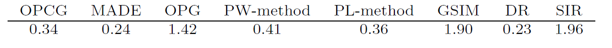
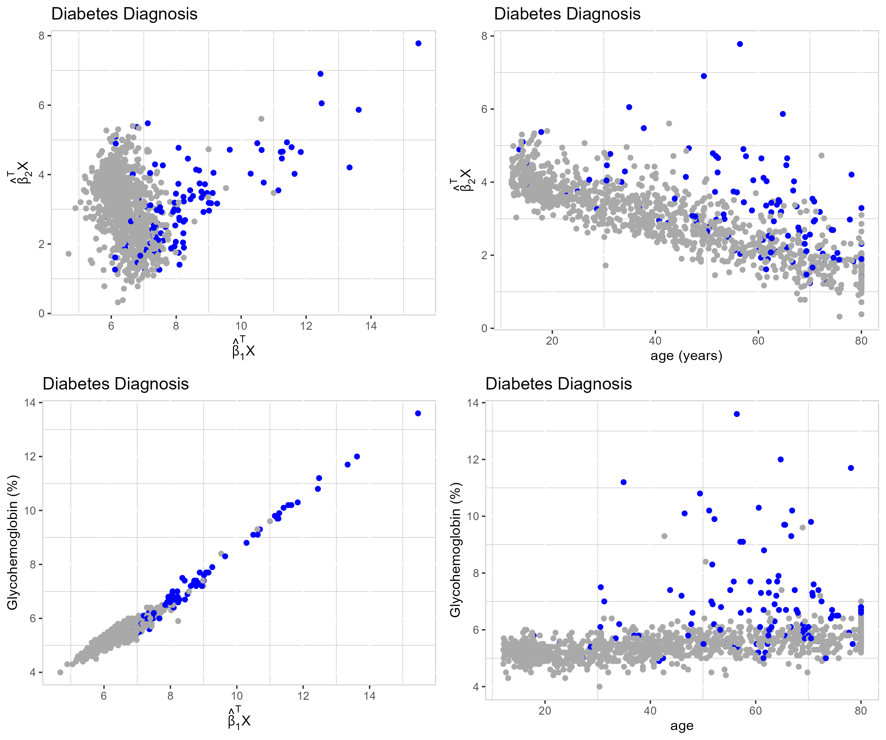

--- 
title: "Sufficient Dimension Reduction"
subtitle: "Forward methods for Categorical and Ordinal Responses"
author: "Harris Quach"
institute: "Pennsylvania State University"
date: "2024/01/10"
output:
  xaringan::moon_reader:
    lib_dir: libs
    css: [xaringan-themer.css, "mytheme.css"]
    # "hygge-duke","cols.css", "ninjutsu" ,"assets/ninpo.css", 
    nature:
      highlightStyle: github
      highlightLines: true
      countIncrementalSlides: false
      # beforeInit: "my_macros.js" # Macros File
      # For Live Preview, run xaringan::inf_mr() in console
    # toc: true
    # toc_depth: 3
    includes:
      before_body: local_tex.html
    seal: false
   
# "rutgers-fonts","rutgers", "hygge", "shinobi"

---

```{r xaringan-themer, include = FALSE}

library(xaringanthemer)

style_xaringan(
  text_color = "#000",
  header_color = "#2d60ba",
  background_color = "#FFF",
  link_color = "rgb(249, 38, 114)",
  text_bold_color = "#2d60ba", 
  padding = "16px 64px 16px 64px", 
  code_highlight_color = "rgba(255,255,0,0.5)",
  code_inline_color = "#000",
  code_inline_background_color = NULL,
  code_inline_font_size = "1em",
  inverse_background_color = "#1e407c",
  inverse_text_color = "#d6d6d6",
  inverse_text_shadow = FALSE, 
  footnote_color = NULL,
  footnote_font_size = "0.9em",
  footnote_position_bottom = "60px",
  left_column_subtle_color = "#777",
  left_column_selected_color = "#000",
  blockquote_left_border_color = "lightgray",
  table_border_color = "#666",
  table_row_border_color = "#ddd",
  table_row_even_background_color = "#eee",
  base_font_size = "20px",
  text_font_size = "1rem",
  header_h1_font_size = "1.5rem",
  header_h2_font_size = "1.25rem",
  header_h3_font_size = "1.25rem", 
  header_background_ignore_classes = c("normal", "inverse", "title", "middle",
                                       "bottom"),
  text_slide_number_font_size = "0.9em", 
  extra_css = list("h2" = list("color" = "#9ab6e7")  #03A696;
  ), 
  outfile = "xaringan-themer.css"
)
```

```{r, load_refs, include=FALSE, cache=FALSE}
library(RefManageR)
BibOptions(check.entries = FALSE,
           bib.style = "authoryear",
           cite.style = "text",
           style = "markdown",
           hyperlink = FALSE,
           dashed = FALSE)
bib_sdr <- ReadBib("bib_sdr.bib",
                   check = FALSE)
bib_surv <- ReadBib("bib_surv.bib",
                   check = FALSE)
bib_funsdr <- ReadBib("bib_funsdr.bib",
                   check = FALSE)
```
 


<!-- class: title-slide -->

# Sufficient Dimension Reduction
## Forward methods for Categorical and Ordinal Responses

<hr/>

Harris Quach (joint work with Dr. Bing Li) <br/> Date: "2024/01/10"


---
class: inverse, middle

<!-- inverse makes the background black and text white -->

# .bg-text.center[Overview of Talk]  

.md-text[
  
1. An overview of sufficient dimension reduction (SDR)
  
2. Motivating idea for our approach
  
3. Broad summary of our procedure

4. Tuning procedure for our method

4. Application to National Health and Nutrition Examination Study - glycohemoglobin data

Main Source: 

Quach, H., & Li, B. (2023). On forward sufficient dimension reduction for categorical and ordinal responses. *Electronic Journal of Statistics*, 17(1), 980-1006.
<!-- `r Cite(bib_sdr, author=c("quach"), title="forward", year="2023")`  -->

]

---
class: left, top
# What is Sufficient Dimension Reduction? 


Suppose we have a large dataset with some response $Y \in \R^m$ and predictors $X \in \R^p$.

  - When $p$ is large, lower dimensional summaries of $X$ are helpful for visualization and application of conventional statistical methods

  - Finding a lower dimensional summary of $X$ means finding $\beta \in \R^{p \times d}$, where $d < p$, in order to construct the lower dimensional summary $\beta^\top X$
  
  - Sufficient Dimension Reduction (SDR) are approaches for finding $\beta$ such that $\beta^\top X$ retains all relevant information about $Y$
  
  - The information preserved by $\beta$ is characterized by conditional independence
  
  - The mapping $\beta$ preserves different information by satisfying different conditional independence criteria 
**NOTE:**
**We refer to $\beta$ and $\mathrm{span}(\beta)$ interchangeably.**


---
class: left, top
# Central Subspaces

Two subspaces of conventional interest:

  - $Y \indep X | \beta^\top X$; `r Cite(bib_sdr, author="Li", title="dimension", year="2018")`
    - $\beta$ preserves all information between $Y$ and $X$; 
    - the smallest such subspace is called the **Central Subspace**. 

  - $Y \indep E(Y|X) | \beta^\top X$; `r Cite(bib_sdr, author=c("ma", "Li"), title="mean")`
    - $\beta$ preserves all information between $Y$ and $E(Y|X)$; 
    - the smallest such subspace is called the **Central Mean Subspace**. 


 
---
class: left, top
# Survival Analysis and SDR
  
  - Response is time-to-event, $T>0$, with potential censoring $C$. The observed time-to-event is $Y = \min\{T,C\}$. 
  
  - Typical assumptions are $T \indep C | X$.
  
  - The subspace of interest, $Y \indep X | \beta_0^\top X$, is not observable due to censoring.
  
  - But it is a direct sum of $T \indep X | \beta_1^\top X$ and $C \indep X | \beta_2^\top X$:
  
      - `r Cite(bib_surv, author="xia", title="survival", year="2010")`.   
        -  Uses many of the same methods presented here, but with survival and hazard functions.  
        
      - `r Cite(bib_surv, author="yi", title="survival", year="2022")`.   
        -  Working under $C \indep X$, when covariates are error prone;  
      
      - `r Cite(bib_surv, author="cui", title="kernel", year="2023")`.   
        -  Using RKHS theory to find and preserve non-linear relationships;  
  
---
class: inverse, center, middle

# .bg-text[Big picture of our SDR approach]  

---
class: left, top
# Motivating Example: 

Consider a response $Y$ and predictor $X = (X_1, X_2) \in [0,1]^2$. 
Let $Y=X_1^2$.
Then $Y= (\beta^\top X)^2$, where $\beta = (1,0) \in \R^2$. 
- we want to recover $span(\beta) = \{ (c,0): c \in \R\}$;
.center[

]


---
class: left, top <!-- formatting the slide -->

<!-- the title --> 

# Motivating Example: 
## Inverse Regression for SDR - Sliced Inverse Regression `r Cite(bib_sdr, author="Li", title="Sliced", year="1991")`

.center[

]

<!-- <iframe src="images/almost_sir.html" width="90%" height="90%" frameborder="0"></iframe> -->


---
count: false
class: left, top <!-- formatting the slide -->

<!-- the title --> 

# Motivating Example: 
## Inverse Regression for SDR - Sliced Inverse Regression `r Cite(bib_sdr, author="Li", title="Sliced", year="1991")`

.center[

]

---
count: false
class: left, top <!-- formatting the slide -->

<!-- the title --> 

# Motivating Example: 
## Inverse Regression for SDR - Sliced Inverse Regression `r Cite(bib_sdr, author="Li", title="Sliced", year="1991")`

.center[

]

---
count: false
class: left, top <!-- formatting the slide -->

<!-- the title --> 

# Motivating Example: 
## Inverse Regression for SDR - Sliced Inverse Regression `r Cite(bib_sdr, author="Li", title="Sliced", year="1991")`

.center[

]

---
count: false
class: left, top <!-- formatting the slide -->

<!-- the title --> 

# Motivating Example: 
## Inverse Regression for SDR - Sliced Inverse Regression `r Cite(bib_sdr, author="Li", title="Sliced", year="1991")`

.center[

]
--

  - 'Inverse' because we work with $X|Y$ quantities;  $E(X|Y)$ in particular here.

---
class: left, top <!-- formatting the slide -->

<!-- the title --> 

# Motivating Example: 
## Inverse Regression for SDR - Drawbacks

.center[

]

---
count: false
class: left, top  

# Motivating Example: 
## Inverse Regression for SDR - Drawbacks

.center[

] 

---
count: false
class: left, top  

# Motivating Example: 
## Inverse Regression for SDR - Drawbacks

.center[

] 

---
count: false
class: left, top  

# Motivating Example: 
## Inverse Regression for SDR - Drawbacks

.center[

] 
--
- Inverse methods require assumptions on the support of the predictor.


---
class: left, top  

# Forward Regression for SDR
## Outer Product of Gradients (OPG) `r Cite(bib_sdr, author="Xia", title="adaptive")`

.center[

] 

---
count: false
class: left, top <!-- formatting the slide -->

<!-- the title --> 
 
# Forward Regression for SDR
## Outer Product of Gradients (OPG) `r Cite(bib_sdr, author="Xia", title="adaptive")`


.center[

] 

---
count: false
class: left, top <!-- formatting the slide -->

<!-- the title --> 
 
# Forward Regression for SDR
## Outer Product of Gradients (OPG) `r Cite(bib_sdr, author="Xia", title="adaptive")`
 

.center[

] 


---
count: false
class: left, top <!-- formatting the slide -->

<!-- the title --> 
 
# Forward Regression for SDR
## Outer Product of Gradients (OPG) `r Cite(bib_sdr, author="Xia", title="adaptive")`
 

.center[

] 

--
- "Forward" Regression because we are estimating $E(Y|x)$ and $\partial E(Y|x)/\partial x^\top$

---
count: false
class: left, top <!-- formatting the slide -->

<!-- the title --> 
 
# Forward Regression for SDR
## Outer Product of Gradients (OPG) `r Cite(bib_sdr, author="Xia", title="adaptive")`


.center[

] 

---
count: false
class: left, top
# Forward Regression for SDR
## Outer Product of Gradients (OPG) `r Cite(bib_sdr, author="Xia", title="adaptive")`


.center[

]

---
class: inverse, middle

<!-- inverse makes the background black and text white -->

# .center[.bg-text[Forward SDR for Categorical and Ordinal Response]  ]

.md-text[
  
1. We show ordinal random variables are linear exponential families
  
2. We extend a popular Sufficient Dimension Reduction method to linear exponential families, and provide some theoretical results
  
3. We propose a K-means tuning procedure for our method
  
]


---
class: left, top
# Forward Regression for SDR

.center[


]

- OPG applies to uni-variate, continuous $Y$
- Doesn't work as well when $Y$ is categorical or ordinal 
- **We fit a local multivariate GLM**


---
class: left, top
# Fitting a local multivariate GLM

We are interested in categorical and ordinal $Y$.

--

Categorical variables are linear exponential families (hence GLM) because they are a special case of the multinomial

  - the multivariate Logistic and Expit functions are the canonical and inverse canonical links

**Contribution:** Ordinal variables can be represented explicitly as a linear exponential family

  - We derive its multivariate canonical link, inverse multivariate canonical link, and cumulant generating function.

  - the canonical link is analogous to the **Adjacent Categories** logistic link `r Cite(bib_sdr, author="agresti", title="ordinal")` 
 

---
class: left, top
# Forward Regression for SDR 
##Proposal: Fit a local multivariate GLM

Existing work in this direction:

1. Generalized Single Index Model (GSIM): `r Citet(bib_sdr, author=c("Lambert"),title=c("Local"))`
  - Local Linear GLM for uni-variate $Y$; 
  - Generalizes the Average Derivative Estimator (ADE) `r Citet(bib_sdr, author=c("stoker"),title=c("derivatives"))`; 
  - ADE has known drawbacks; e.g. requires gradient has non-zero mean. 

2. Minium Average Deviance Estimation (MADE): `r Citet(bib_sdr, author=c("adragni"),title=c("Minimum"))`
  - Local Linear GLM for uni-variate $Y$ 
    - Generalizes the Minimum Average Variance Estimator (MAVE) of `r Citet(bib_sdr, author=c("xia"),title=c("adaptive"))`  

**Handles multi-labels inefficiently.**


---
class: inverse, center, middle

<!-- inverse makes the background black and text white -->

# .bg-text[Outer Product of Canonical Gradients (OPCG)] 

---
class: left, top 
 
# Generalized Forward Regression for SDR

.center[

]  

- Instead, fit a multivariate GLM about $x_0$ and minimize
\begin{align*}
  -\ell (a_{x_0}, B_{x_0},x_0)  = - [a_{x_0} + B_{x_0}^\top(x-x_0)]^\top y + b[a_{x_0} + B_{x_0}^\top(x-x_0)] 
  .
\end{align*}
We will use the minimizer $\hat B_{x_0}$. 

---
class: left, top

# Why use $B_{x_0}$ in the GLM?

## Our Dimension Reduction Assumption

- In OPG, the dimension reduction assumption is $\beta$ satisfies $E(Y|X) = E(Y|\beta^\top X)$. 
  
- Our the dimension reduction assumption is $\beta$ satisfies $Y \indep \theta(X)|\beta^\top X$, i.e. $\theta(X) = \tilde \theta(\beta^\top X)$. 

  - $\theta(X)$ is the canonical parameter of the multivariate GLM, through which $X$ relates to $Y$ 
  
    - For linear exponential families, $\theta(X) = link^{-1}(E(Y|X))$, so our dimension reduction assumption is equivalent to that in OPG.

---
class: left, top

# Why use $B_{x_0}$ in the GLM?

## Our Dimension Reduction Assumption

  - Because $\theta(X) = \theta(\beta^\top X)$, the gradient of $\theta(x)$ satisfies
  
\begin{align*}
\partial \theta(x)^\top /\partial x = \beta \partial
\tilde \theta(u)^\top/\partial u
\end{align*}
  
  - That is, $\mathrm{span}(\partial \theta(x)^\top /\partial x) \subseteq \mathrm{span}(\beta)$; so gradient can recover part of the subspace at least.
  
      <!-- - We say $\partial \theta(x)^\top /\partial x$ is *unbiased* for the central mean subspace. -->
      
---
class: left, top

# Why use $B_{x_0}$ in the GLM?

## Our Dimension Reduction Assumption

<!-- - In OPG, $\hat B_{x_0}$ estimates the gradient of $E(Y|X=x)$ at $x_0$, i.e. $\partial E(Y|X=x_0) /\partial x^\top$. -->

- The $\hat B_{x_0}$ obtained from minimizing
\begin{align*}
-\ell_0(a_0, B_0;y,x,x_0) = -[a_0 + B_0^\top(x-x_0)]^\top y + b[a_0 + B_0^\top(x-x_0)].
\end{align*}

** $\hat B_{x_0}$ estimates the gradient of $\theta(x)$ at $x_0$, i.e. $\partial \theta(x_0) /\partial x^\top$; the canonical gradient at $x_0$.**

---
class: left, top

# Outer Product of Canonical Gradients (OPCG)

Given a random sample $Y_{1:n}$, $X_{1:n}$, fit a local linear multivariate GLM about $x_0$ by minimizing
\begin{align*}
& -\ell (a_{x_0}, B_{x_0}, x_0, ;X_{1:n}, Y_{1:n}) \\
= &
\frac 1n \sum_{i=1}^n
K \bigg ( \frac{X_i - x_0}{h} \bigg )
\{-[a_{x_0} + B_{x_0}^\top (X_i - x_0)]^\top Y_i + b[a_{x_0} + B_{x_0}^\top (X_i - x_0) ] \}
\end{align*}
where $b(\cdot)$ determines the GLM, and $K(\cdot)$ is a kernel weight with bandwidth $h$. 
The minimizer $\hat B_{x_0}$ is used to estimate $\partial \theta(x_0) /\partial x^\top$.

.center[
 
]

---
class: left, top

# Outer Product of Canonical Gradients (OPCG)

We fit a local linear multivariate GLM about each $X_j$, for $j=1,...,n$, by minimizing the full negative local linear log-likelihood:

\begin{align*}
& L(a_1,..,a_n, B_1,...,B_n; X_{1:n}, Y_{1:n})  \\
= & -\frac {1}{n} \sum_{j,i=1}^n
K \bigg ( \frac{X_i - X_j}{h} \bigg ) 
\{[a_{j} + B_{j}^\top (X_i - X_j)]^\top Y_i - 
b(a_{j} + B_{j}^\top (X_i - X_j)) \} 
.
\end{align*}

This provides a collection of minimizers $\hat B_1,\ldots,\hat B_n$; where $\hat B_j$ estimates $\partial \theta(X_j)/\partial x^\top$.

.center[
 
]
---
class: left, top

# The OPCG Estimator

We use $\hat B_1,\ldots, \hat B_n$ to construct the average outer product
$$\hat \Lambda_{\mathrm{opcg}} = \frac 1n \sum_{j=1}^n \hat B_j \hat B_j^\top.$$ 

The **Outer Product of Canonical Gradients (OPCG) Estimator, $\hat \beta_{\mathrm{opcg}}$**, is the $d$ leading eigenvectors of $\hat \Lambda_{\mathrm{opcg}}$.

.center[

]  

---
class: left, top 
# Properties related to OPCG
## Under some regularity assumptions...

  <div class="prop" text="Exhaustiveness">
  Let
  \begin{align*}
  \Lambda_{\mathrm{opcg}}
  =
  E 
  \bigg \{ 
  \frac{\partial \theta(X)^\top}{\partial x}
  \frac{\partial \theta(X)}{\partial x^\top}
  \bigg \}
  .
  \end{align*}
  Under SDR and rank assumptions, \(\mathrm{span}( \Lambda_{\mathrm{opcg}} ) = \SS_{E(Y|X)}  \).
  </div>   
--
  <br/><br>
  <div class="theorem" text="Consistency of OPCG">
  Let \(\eta\) be the leading \(d\) eigenvectors of \(\Lambda_{\mathrm{opcg}}\). Then, under some regularity, compactness and bandwidth assumptions, we have
  \begin{align*}
  \| \hat \Lambda_{\mathrm{opcg}} -
  \Lambda_{\mathrm{opcg}} \|_F = O_{a.s}
  ( h + h^{-1} \delta_{ph} + ( \log(n)/n )^{1/2} ),\\
   \Rightarrow \| \hat \beta_{\mathrm{opcg}} - \eta \|_F = O_{a.s}
  ( h + h^{-1} \delta_{ph} + ( \log(n)/n )^{1/2} ),
  \end{align*}
  where \(\delta_{ph} = \sqrt{ \frac{\log n}{ nh^p} }\),
  \(  h \downarrow 0\), and \( h^{-1}\delta_{ph} \to 0\).
  </div>


---
class: left, top 
# Estimating the dimension, $d$ 

  - Ladle plot and Predictor Augmentation methods are fast, eigen-based methods that can be applied to OPCG estimate $d$. `r Citep(bib_sdr, author=c("luo"),title=c("combining", "augmentation"))`
  
    - Uses variation in eigenvectors and eigenvalues of $\hat \Lambda_{\mathrm{opcg}}$ to determine $d$.

    - cannot be applied to aforementioned methods
    
  <!-- - Cross-validation or sequential testing methods can be used to estimate $d$ for MADE. `r Citep(bib_sdr, author=c("adragni", "xia"),title=c("average", "adaptive"))` -->
 
---
class: inverse, center, middle

# .bg-text[Tuning the bandwidth]

---
class: left, top 
# Tuning the bandwidth, $h$.

.center[

]  

The bandwidth $h$ in the kernel $K(h^{-1} \|X_i - X_j \|)$ determines the size of the local neighbourhoods about points $X_j$.

This bandwidth needs to be tuned in our forward regression approaches. 

---
class: left, top
# Tuning the bandwidth, $h$.
 
We need to tune $h$ in OPCG:

  - Cross Validation requires specifying a prediction method beforehand. 

  - Can choose $h$ according to optimal bandwidth, such as $h^{opt} = cn^{-\frac{1}{(p+6)}}$ `r Cite(bib_sdr, author=c("xia"), title="constructive")`
  
    - but suggested values of $c$ does not always work, and then you need to tune $c$.

--

For classification problems, we propose using a K-means clustering procedure for tuning $h$.

Our intuition: 

  - SDR should make classification easier, and classification is easiest when the dimension reduced predictors $\hat \beta^\top X$ are clustered into their respective labels.

---
class: left, top
# Tuning the bandwidth, $h$.

Let $Y \in \{1,...,m\}$ be categorical response and our training set is size $n$. We split the training set into $(Y, X)_{1:n_1}$ for estimation, and $(Y,X)_{1:n_2}^{\mathbb{V}}$ for validation.

--

Main idea: For each $h$, 

1. Estimate $\hat \beta_{\mathrm{opcg}}$ on $(Y, X)_{1:n_1}$ and construct $\hat \beta_{\mathrm{opcg}}^\top X_{1:n_2}^{\mathbb{V}}$.

2. Apply K-means to sufficient predictors $\hat \beta_{\mathrm{opcg}}^\top X_{1:n_2}^{\mathbb{V}}$ for $m$ clusters.

  - This returns $m$ estimated clusters and the F-ratio, for each $h$.

3. Select $h$ that minimizes the F-ratio from K-means. 

  - Small F-ratio means small WSS and large BSS

---
class: left, top
# Tuning the bandwidth, $h$.
 
But 
 - Estimating $m$ clusters implicitly assumes we have only 1 cluster per class
 - We ought to incorporate the class/label information from $Y_{1:n_2}^{\mathbb{V}}$, when available.

We modify K-means so that:

1. we estimate more than 1 cluster per class;

2. uses label information from $Y_{1:n_2}^{\mathbb{V}}$; a "supervised" K-means

This "supervised k-means" is applied on the training set in a r-fold manner.

---
class: inverse, center, middle

<!-- inverse makes the background black and text white -->

# .bg-text[Simulations and Data Analyses]


---
class: left, top
# Simulations


Our predictor will be $X=(X_1,X_2,X_3,...,X_{10}) \in \R^{10}$.

  - $(X_3, X_7)$ is sampled from one of 5 clusters, generated by a bivariate normal
    - Then augmented with 8 standard normals, so $p=10$.

  - Two clusters are labeled 1, two are labeled 2, and one cluster is labeled 3; So $Y \in \{1,2,3\}$ is categorical.
 
  - We sample 300 for our training set and 150 for testing. We split the training set in half for estimation and validation.  
 

---
class: ani-slide
# K-mean Tuning for $h$
 
<iframe src="images_opcg/tuning_sc.html" width="100%" height="95%" frameborder="0" ></iframe>


---
count: false
class: left, top
# Simulations - tuning and estimation

K-fold supervised K-means Tuning: $h \approx 1.26$;


  
  - SIR is Sliced Inverse Regression `r Cite(bib_sdr, author=c("li"), title="inverse", year="1991")`  
  
  - DR is Directional Regression `r Cite(bib_sdr, author=c("li"), title="directional")`  
  
  - PL-method is a per-label approach; Lambert-Lacroix and Peyre's suggestion for multi-label problems.
    <!-- - estimates 2 SDR directions per binary logistic problem for each class, for 6 total, and selects the 2 that explain the most variation. -->
    
  - PW-method is pairwise approach; Adragni's suggestion for multi-label problems.  
    <!-- - estimates 2 SDR directions per pair of classes \{1,2\}, \{1,3\}, and \{2,3\}, for 6 total, and selects the 2 that explain the most variation.  -->

---
class: center, middle, inverse
# .bg-text[Application to a National Health and Nutrition Examination Survey Dataset]
## Source: http://hbiostat.org/data courtesy of the Vanderbilt University Department of Biostatistics 
 

---
class: left, top
# NHANES glycohemoglobin data
  
  - Collection of studies to assess health of adults and children in the US. 
  
  - Surveys a representative sample of about 5000 individuals every year, collecting interviews and physical examinations.
      
      - Data collected include demographic, socioeconomic, dietary surveys;
      
      - Medical and Physiological measurements are collected;
      
      - Laboratory tests are conducted by medical professionals; 

  - The data set hosted by Vanderbilt University is a cleaned and process subset of one NHANES survey, year unknown.
  
      - Data includes demographic and body measurements related to Diabetes in participants
  
---
class: left, top
# NHANES glycohemoglobin data
## Demographic Characteristics

 <!-- 6795 observations and 20 variables, maximum # NAs:971     -->

<!-- # seqn is respondents sequence number -->

<!-- # gh is glycohemoglobin levels -->
<!-- # tx is indicator for "on Insulin of Diabetes Mellitus Drugs"  -->
<!-- # dx is indicator for diagnosed with Diabetes Mellitus or Pre DM -->
<!-- # 2 levels of sex -->
<!-- # 5 levels of race -->
<!-- # 14 levels of income -->

<!-- # wt is weight -->
<!-- # ht is standing height -->
<!-- # bmi is BMI  -->
<!-- # leg - upper leg length -->
<!-- # arml - upper arm length -->
<!-- # armc - arm circum -->
<!-- # waist - waist circum -->
<!-- # tri - Triceps Skinfold -->
<!-- # sub - Subscapular Skinfold -->
<!-- # albumin - albumin levels -->
<!-- # bun - bloord urea nitrogen -->
<!-- # SCr - Creatinine  -->

<iframe src="images_pharma_biotech/demo_gtable.html" width="100%" height="90%" frameborder="0" ></iframe>


---
class: left, top
# NHANES glycohemoglobin data
## Body Measurements 

 <!-- 6795 observations and 20 variables, maximum # NAs:971     -->

<!-- # seqn is respondents sequence number -->

<!-- # gh is glycohemoglobin levels -->
<!-- # tx is indicator for "on Insulin of Diabetes Mellitus Drugs"  -->
<!-- # dx is indicator for diagnosed with Diabetes Mellitus or Pre DM -->
<!-- # 2 levels of sex -->
<!-- # 5 levels of race -->
<!-- # 14 levels of income -->

<!-- # wt is weight -->
<!-- # ht is standing height -->
<!-- # bmi is BMI  -->
<!-- # leg - upper leg length -->
<!-- # arml - upper arm length -->
<!-- # armc - arm circum -->
<!-- # waist - waist circum -->
<!-- # tri - Triceps Skinfold -->
<!-- # sub - Subscapular Skinfold -->
<!-- # albumin - albumin levels -->
<!-- # bun - bloord urea nitrogen -->
<!-- # SCr - Creatinine  -->

<iframe src="images_pharma_biotech/biom_gtable.html" width="100%" height="90%" frameborder="0" ></iframe>

---
class: left, top
# Application of OPCG to NHANES glycohemoglobin data

For Convenience: 
  - Drop individuals with missingness 
  - Do not consider Categorical Predictors that cannot be interpreted as continuous
      - e.g. race, sex, treatment status
      - Dropped individuals with "< 20000" and "> 20000" as income to convert to continuous
 
Outcomes:
  - Binary: Diabetes Diagnosis
  - Ordinal: No Diabetes, Pre-Diabetes, Diabetes
      - Derived from Glycohemoglobin according to normal levels from CDC website
      - Normal: < 5.6; Pre-Diabetes: 5.6 to 6.4; Diabetes: > 6.4 
      

We use roughly 4000 observations for estimation. The remaining observations are used as a testing set to validate our results.
       
---
class: left, top
# Diabetes Diagnosis  

```{r fig.show = "hold", out.width = "85%", fig.align = "center", echo=FALSE}

```
---
class: left, top
# Glycohemoglobin Levels 


```{r fig.show = "hold", out.width = "85%", fig.align = "center", echo=FALSE}
knitr::include_graphics("images_pharma_biotech/ord_plots.png")
```


---
class: left, middle, inverse
# .bg-text[Summary of Presentation]

1. Overview of Sufficient Dimension Reduction.

2. Outline of the motivation behind OPCG and K-Means Tuning 

3. Application to a National Health and Nutrition Examination Survey Dataset

---
layout: false
# References

```{r, echo=FALSE, results="asis"}
PrintBibliography(c(bib_sdr, bib_surv), start=1, end=5)
```

---
layout: false
# References

```{r, echo=FALSE, results="asis"}
PrintBibliography(c(bib_sdr, bib_surv), start=6, end=11)
```

---
layout: false
# References

```{r, echo=FALSE, results="asis"}
PrintBibliography(c(bib_sdr, bib_surv), start=12, end=17)
```

---
layout: false
# References

```{r, echo=FALSE, results="asis"}
PrintBibliography(c(bib_sdr, bib_surv), start=17)
```
