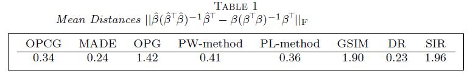
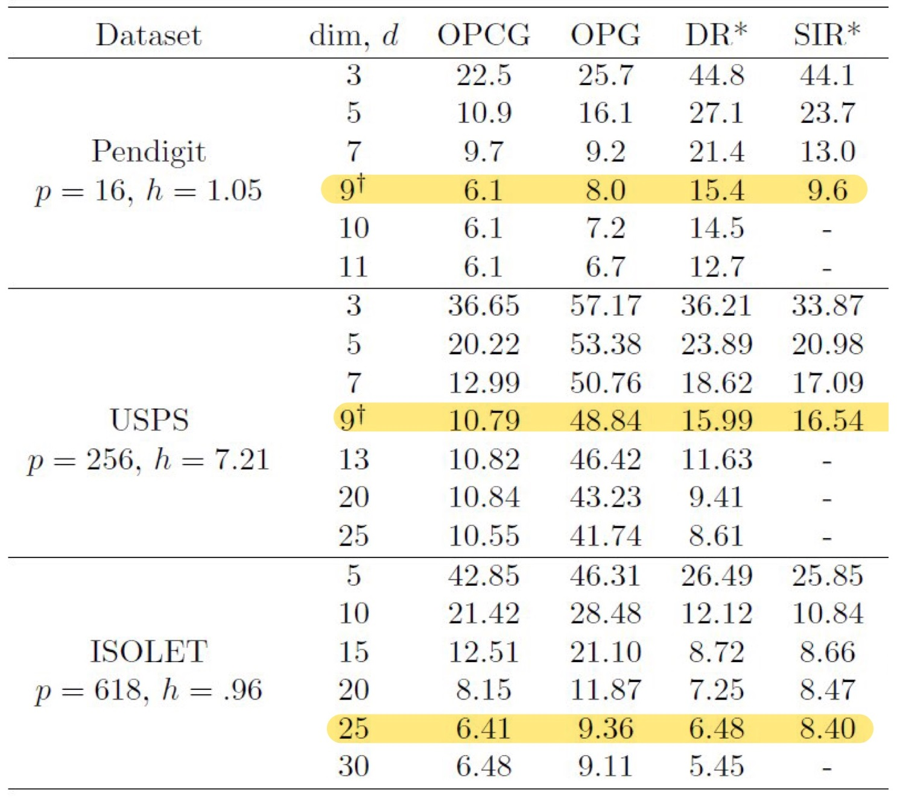

--- 
title: "Forward Sufficient Dimension Reduction for Categorical and Ordinal Responses"
# subtitle: "with Multinomial Response"
author: "Harris Quach"
institute: "Pennsylvania State University"
date: "2022/08/07 (updated: `r Sys.Date()`)"
output:
  xaringan::moon_reader:
    lib_dir: libs
    css: [xaringan-themer.css, "mytheme.css"]
    # "hygge-duke","cols.css", "ninjutsu" ,"assets/ninpo.css", 
    nature:
      highlightStyle: github
      highlightLines: true
      countIncrementalSlides: false
      # beforeInit: "my_macros.js" # Macros File
      # For Live Preview, run xaringan::inf_mr() in console
    # toc: true
    # toc_depth: 3
    includes:
      before_body: local_tex.html
    seal: false
   
# "rutgers-fonts","rutgers", "hygge", "shinobi"

---

```{r xaringan-themer, include = FALSE}

library(xaringanthemer)

style_xaringan(
  text_color = "#000",
  header_color = "#2d60ba",
  background_color = "#FFF",
  link_color = "rgb(249, 38, 114)",
  text_bold_color = "#2d60ba", 
  padding = "16px 64px 16px 64px", 
  code_highlight_color = "rgba(255,255,0,0.5)",
  code_inline_color = "#000",
  code_inline_background_color = NULL,
  code_inline_font_size = "1em",
  inverse_background_color = "#1e407c",
  inverse_text_color = "#d6d6d6",
  inverse_text_shadow = FALSE, 
  footnote_color = NULL,
  footnote_font_size = "0.9em",
  footnote_position_bottom = "60px",
  left_column_subtle_color = "#777",
  left_column_selected_color = "#000",
  blockquote_left_border_color = "lightgray",
  table_border_color = "#666",
  table_row_border_color = "#ddd",
  table_row_even_background_color = "#eee",
  base_font_size = "20px",
  text_font_size = "1rem",
  header_h1_font_size = "1.5rem",
  header_h2_font_size = "1.25rem",
  header_h3_font_size = "1.25rem", 
  header_background_ignore_classes = c("normal", "inverse", "title", "middle",
                                       "bottom"),
  text_slide_number_font_size = "0.9em", 
  extra_css = list("h2" = list("color" = "#9ab6e7")  #03A696;
  ), 
  outfile = "xaringan-themer.css"
)
```

```{r, load_refs, include=FALSE, cache=FALSE}
library(RefManageR)
BibOptions(check.entries = FALSE,
           bib.style = "authoryear",
           cite.style = "text",
           style = "markdown",
           hyperlink = FALSE,
           dashed = FALSE)
bib_sdr <- ReadBib("bib_sdr.bib",
                   check = FALSE)
bib_opg <- ReadBib("bib_opg.bib",
                   check = FALSE)
```
 

<!-- class: title-slide -->

# On Forward Sufficient Dimension Reduction for Categorical and Ordinal Responses
<!-- # .bg-text[Generalized Forward Sufficient Dimension Reduction for Classification] -->
<!-- <hr width="700" align="left" /> -->
<hr/>

Harris Quach (joint work with Dr. Bing Li) <br/> Date: "2022/08/07 (updated: `r Sys.Date()`)"

---
class: inverse, middle

<!-- inverse makes the background black and text white -->

# .bg-text.center[Overview of paper]  

.md-text[
  
1. We show ordinal variables are linear exponential families
  
2. We generalize a popular SDR method to linear exponential families
  
3. We proposed a K-means tuning procedure
  
]
 

---
class: left, top
# Context  

  - Suppose $Y| X \sim GLM(\theta(X))$ and predictors $X \in \R^p$ are continuous.
    - So Y depends on X solely through a smooth function $\theta(\cdot)$.
    - Categorical and Ordinal-Categorical variables are examples of such GLMs
  
  - Assume a Sufficient Dimension Reduction exists: There exists a linear map $\beta \in \R^{p \times d}$, $d < p$, such that
  
\begin{align*}
 Y \indep \theta(X) | \beta^{\top} X
\end{align*}


## Goal: Estimate the subspace spanned by $\beta$ 
  - i.e. construct lower-dimensional summaries of $X \in \R^p$ that are informative for $Y$, where $Y$ is Categorical or Ordinal.

---
class: left, top
# Motivating Example: 

Suppose $X = (X_1, X_2) \in [0,1]^2$ with some restricted support and $\theta(X) = X_1^2$. 
Then $\theta(X) = (\beta^\top X)^2$, where $\beta = (1,0) \in \R^2$.

- we want to recover $span(\beta) = \{ (c,0): c \in \R\}$;

.center[

] 

---
class: left, top <!-- formatting the slide -->
# 1. Outer Product of Canonical Gradients (OPCG) 
## Generalizes the Outer Product of Gradients (OPG) `r Cite(bib_sdr, author="Xia", title="adaptive")`

.center[

] 

---
count: false
class: left, top <!-- formatting the slide -->
# 1. Outer Product of Canonical Gradients (OPCG) 
## Generalizes the Outer Product of Gradients (OPG) `r Cite(bib_sdr, author="Xia", title="adaptive")`


.center[

] 


---
count: false
class: left, top <!-- formatting the slide -->
# 1. Outer Product of Canonical Gradients (OPCG) 
## Generalizes the Outer Product of Gradients (OPG) `r Cite(bib_sdr, author="Xia", title="adaptive")`


.center[

] 

--

- Fitting a local linear GLM to estimate the gradients at each point.

---
count: false
class: left, top <!-- formatting the slide -->
# 1. Outer Product of Canonical Gradients (OPCG) 
## Generalizes the Outer Product of Gradients (OPG) `r Cite(bib_sdr, author="Xia", title="adaptive")`
 


.center[

] 

--
- Use a eigen decomposition to get direction most variation.

---
count: false
class: left, top <!-- formatting the slide -->
# 1. Outer Product of Canonical Gradients (OPCG) 
## Generalizes the Outer Product of Gradients (OPG) `r Cite(bib_sdr, author="Xia", title="adaptive")`
 


.center[

]

- Effectively a PCA on the estimated gradients; **Estimated directions form the OPCG Estimator, $\hat \beta_{\mathrm{opcg}} \in \R^{p \times d}$.**


---
class: left, top

# Outer Product of Canonical Gradients (OPCG)

Given a random sample $Y_{1:n}$, $X_{1:n}$, fit a local linear GLM about each $X_j$, for $j=1,...,n$, by minimizing the full negative local linear log-likelihood:
\begin{align*}
& L(a_1,..,a_n, B_1,...,B_n; X_{1:n}, Y_{1:n}) \\  
= & -\frac {1}{n} \sum_{j,i=1}^n
K \bigg ( \frac{X_i - X_j}{h} \bigg )\\
& \times 
\{[a_{j} + B_{j}^\top (X_i - X_j)]^\top Y_i - 
b(a_{j} + B_{j}^\top (X_i - X_j)) \} 
,
\end{align*}
where $b(\cdot)$ determines the local GLM, and $K(\cdot)$ is a kernel weight with bandwidth $h$. 

--

This provides minimizers $\hat B_j$ that estimate $\partial \theta(X_j)/\partial x^\top$, which we use to construct the average outer product
$$\hat \Lambda_n = \frac 1n \sum_{j=1}^n \hat B_j \hat B_j^\top.$$ 

---
class: left, top

# The OPCG Estimator

The **Outer Product of Canonical Gradients (OPCG) Estimator** for $\beta$, $\hat \beta_{opcg}$, is the first $d$ eigenvectors of 
$$\hat \Lambda_n = \frac 1n \sum_{j=1}^n \hat B_j \hat B_j^\top,$$ 
corresponding to the $d$ largest eigenvalues.

.center[
<!--  -->

] 

---
class: left, top 
# Properties related to OPCG

  - OPCG is consistent:
  
  <div class="theorem">
  Under some regularity assumptions, as \( n \to \infty\), we have
  \begin{align*} 
  \| \hat \beta_{opcg}  - \beta \|_F = O_{a.s}
  ( h + h^{-1} \delta_{ph} + \delta_{n} )
  ,
  \end{align*} 
  where \(\delta_{ph} = \sqrt{ \frac{\log n}{ nh^p} }\),
  \(\delta_{n} = \sqrt{ \frac{\log n}{ n } }\),
  \(  h \downarrow 0\), and
  \( h^{-1}\delta_{ph} \to 0\).
  </div>
  
  - Can be implemented using Newton-Raphson

  - Ladle and Predictor Augmentation methods are fast, eigen-based methods that can be applied to estimate $d$. `r Citep(bib_sdr, author=c("luo"),title=c("combining", "augmentation"))`

  - **For the bandwidth $h$,  we propose a K-means approach for tuning that selects $h$ by minimizing an F-ratio.**
    - Cross Validation or Optimal bandwidths can be used as well. 
    

---
class: left, top
# K-means Tuning $h$ for Classification. 

In the local estimation step, we need to select the bandwidth $h$.

.center[

] 

---
class: left, top
# K-means Tuning $h$ for Classification. 

Split your training sample into two sets. Denote the second set by $(X^{\mathbb{V}}, Y^{\mathbb{V}})_{1:n_2}$. For each $h$, 

Essential Idea: 
  1. Estimate $\hat \beta_{\mathrm{opcg}}$ on $(Y, X)_{1:n_1}$ and construct $\hat \beta_{\mathrm{opcg}}^\top X_{1:n_2}^{\mathbb{V}}$
  		
  2. Apply K-means to sufficient predictors $\hat \beta_{\mathrm{opcg}}^\top X_{1:n_2}^{\mathbb{V}}$ for $m$ clusters. 
    - $m$ is the number of categories for $Y$.
    - This returns $m$ estimated clusters and an F-ratio, for each $h$.
  		
  3. Select $h$ that minimizes the F-ratio from K-means.

**Some modifications are made to this idea to address some practical and tuning issues, but the idea remains the same.**

---
count: false
class: inverse, center, middle

# .bg-text[Simulations and Data Analyses]


---
class: left, top
# Simulations 

Let $Y \in \{1,2,3\}$ be categorical and $X \in \R^{10}$. 
We have $(X^3, X^7) \sim N_2(\mu_j, 0.5 I_2)$ for $j=1,2,\ldots,5$, and the rest are $N(0,0.5)$.

  - the 5 clusters are labeled 1, 2, or 3.
  - $Y$ is the label of the cluster $(X^3, X^7)$ belongs, so $Y$ depends on only $\beta^{\top}X = (X^3, X^7)$.

We have a training sample of 300:
  - Use half for $\hat \beta_{\mathrm{opcg}}$ and half for $\hat \beta_{\mathrm{opcg}}^\top X_{1:150}^{\mathbb{V}}$

  - Assume we know $d=2$ for $\hat \beta_{\mathrm{opcg}} \in \R^{ 10 \times 2}$;
  
---
class: ani-slide
# K-mean Tuning for $h$
 
<iframe src="images/tuning_sc.html" width="100%" height="90%" frameborder="0" ></iframe>

---
count: false
class: left, top
# Simulations - tuning and estimation

Conventional suggestion: $h = 2.34 n^{-1/(p+6)} \approx 1.66$;

K-fold K-means Tuning: $h \approx 1.25$;

<br>

Using $h \approx 1.25$ to estimate OPCG $\hat \beta_{opcg}$:



---
class: left, top
# Categorical Data Analysis  

We analyze three datasets with categorical responses: 

  - Handwritten Digits (Pendigit) from UCI
  
    - p=16; train/test=1333/667; resp=0-9
    
  - USPS Handwritten Digits  
  
    - p=256; train/test=1338/669; resp=0-9
    
  - ISOLET from UCI
  
    - p=618; train/test=6334/1553; resp=a-z

---
class: left, top
# Categorical Classification Error using SVM

.center[

]


---
class: left, top
# Ordinal-Categorical Data Analysis
## Red Wine Quality

We analyze the wine quality rating data set from the UCI repository:  
  - Ordinal response - Wine Quality Score, $Y \in \{3,4,5\}$; $p=11$, characteristics of the wine; $n_{train}$ / $n_{test}$: 1000/599; 

Plots of $\hat \beta^{\top} X_{\mathrm{test}}$:


---
class: left, top, inverse
# .bg-text[Conclusion]


1. Generalized OPG to linear exponential families via OPCG

2. Demonstrated a K-means tuning procedure for classification

3. Demonstrated the effectiveness of OPCG in categorical classification problems. 

---
layout: false
# References

```{r, echo=FALSE, results="asis"}
PrintBibliography(bib_sdr, start=1, end=4)
```

<!-- --- -->
<!-- layout: false -->
<!-- # References -->

<!-- ```{r, echo=FALSE, results="asis"} -->
<!-- PrintBibliography(bib_sdr, start=7, end=12) -->
<!-- ``` -->

<!-- --- -->
<!-- layout: false -->
<!-- # References -->

<!-- ```{r, echo=FALSE, results="asis"} -->
<!-- PrintBibliography(bib_sdr, start=13) -->
<!-- ``` -->


