--- 
title: "Generalized Forward Sufficient Dimension Reduction for Classification"
# subtitle: "with Multinomial Response"
author: "Harris Quach"
institute: "Pennsylvania State University"
date: "2021/03/05 (updated: `r Sys.Date()`)"
output:
  xaringan::moon_reader:
    lib_dir: libs
    css: [xaringan-themer.css, "mytheme.css"]
    # "hygge-duke","cols.css", "ninjutsu" ,"assets/ninpo.css", 
    nature:
      highlightStyle: github
      highlightLines: true
      countIncrementalSlides: false
      # beforeInit: "my_macros.js" # Macros File
      # For Live Preview, run xaringan::inf_mr() in console
    # toc: true
    # toc_depth: 3
    includes:
      before_body: local_tex.html
    seal: false
   
# "rutgers-fonts","rutgers", "hygge", "shinobi"

---

```{r xaringan-themer, include = FALSE}

library(xaringanthemer)

style_xaringan(
  text_color = "#000",
  header_color = "#2d60ba",
  background_color = "#FFF",
  link_color = "rgb(249, 38, 114)",
  text_bold_color = "#2d60ba", 
  padding = "16px 64px 16px 64px", 
  code_highlight_color = "rgba(255,255,0,0.5)",
  code_inline_color = "#000",
  code_inline_background_color = NULL,
  code_inline_font_size = "1em",
  inverse_background_color = "#1e407c",
  inverse_text_color = "#d6d6d6",
  inverse_text_shadow = FALSE, 
  footnote_color = NULL,
  footnote_font_size = "0.9em",
  footnote_position_bottom = "60px",
  left_column_subtle_color = "#777",
  left_column_selected_color = "#000",
  blockquote_left_border_color = "lightgray",
  table_border_color = "#666",
  table_row_border_color = "#ddd",
  table_row_even_background_color = "#eee",
  base_font_size = "20px",
  text_font_size = "1rem",
  header_h1_font_size = "1.5rem",
  header_h2_font_size = "1.25rem",
  header_h3_font_size = "1.25rem", 
  header_background_ignore_classes = c("normal", "inverse", "title", "middle",
                                       "bottom"),
  text_slide_number_font_size = "0.9em", 
  extra_css = list("h2" = list("color" = "#9ab6e7")  #03A696;
  ), 
  outfile = "xaringan-themer.css"
)
```

```{r, load_refs, include=FALSE, cache=FALSE}
library(RefManageR)
BibOptions(check.entries = FALSE,
           bib.style = "authoryear",
           cite.style = "text",
           style = "markdown",
           hyperlink = FALSE,
           dashed = FALSE)
bib_sdr <- ReadBib("bib_sdr.bib",
                   check = FALSE)
bib_opg <- ReadBib("bib_opg.bib",
                   check = FALSE)
```
 

<!-- class: title-slide -->

# Generalized Forward Sufficient Dimension Reduction for Categorical and Ordinal Responses
<!-- # .bg-text[Generalized Forward Sufficient Dimension Reduction for Classification] -->
<!-- <hr width="700" align="left" /> -->
<hr/>
## Harris Quach (joint work with Dr. Bing Li) <br/> Date: 2021-03-05

---
class: inverse, middle

<!-- inverse makes the background black and text white -->

# .bg-text.center[Overview]  

.md-text[
  
  1. We show ordinal variables are linear exponential families
  
2. We generalize a popular SDR method to linear exponential families
  
3. We proposed a K-means tuning procedure
  
]
---
count: false
class: top, left
# Outline

1. Multivariate Categorical and Ordinal Link functions for GLMs

  - Categorical Variable
  - Ordinal-Categorical Variable

2. Motivation
  - Inverse Regression for SDR
  - Forward Regression for SDR
  
3. Outer Product of Canonical Gradients (OPCG) 
  
4. Tuning the bandwidth via K-means 

5. Simulations and Data Analysis
  - Simulations
  - Ordinal Data 
  - Categorical Data  

---
class: inverse, center, middle

<!-- inverse makes the background black and text white -->

# .bg-text[Multivariate Link functions]  


---
class: left, top
# Multivariate Links for Linear Exponential Families

The crux of our proposed method is fitting multivariate Generalized Linear Model to categorical or ordinal response variables.

We will see that Categorical and Ordinal responses, $Y$, are linear exponential families.

- Linear exponential families have log-likelihood of the form

\begin{align*}
\ell(\theta;y) = \theta^\top Y - b(\theta);   
\end{align*}

- They are characterized by their means $\mu$, through the canonical parameter $\theta$, 

- The canonical link function $\theta( \cdot ): \mu \mapsto \theta$; the inverse canonical link $\mu(\cdot): \theta \mapsto \mu$

---
class: left, top
# Multivariate Links for Linear Exponential Families

  - Inverse canonical link is useful for 
    
    - determining the function $b(\cdot)$ that specifies the linear exponential family
    
    - evaluating the Mean and Variance as functions of the canonical parameter
      
    - estimate parameters for alternative link functions

  - Canonical link is useful for constructing starting values for optimization algorithms via the projection
  
\begin{align*}
X(X X^\top)^{-1} X \theta(Y)     
\end{align*}


---
class: left, top
# Categorical Response

Suppose $Y \in \{1,...,m\}$ is a categorical variable for $m$ nominal categories. 

- We can represent $Y$ as a vector $S = (S^1,...,S^{m-1}) \in \{0,1\}^{m-1}$

  - we set $S^m = 1 - \sum_{j=1}^{m-1} S^m$.

  - If $Y=k$, then $S^k = 1$ and $S^j=0$ for $j \neq k$. 

  - Eg. $m=3$; if $Y = 2$, then $S = (0,1)$; if $Y=3$, then $S=(0,0)$. 

Let $p = (p^1,...p^{m-1})$ be the $m-1$ probabilities for each category. 
Then
\begin{align*}
E(S) =  p , 
\quad 
Var(S)
= Diag(p) - p p^\top
%\left [ Diag \left ( \frac{  e^{\theta   } }{ 1 + \boldsymbol 1^{\top}e^{\theta } } \right ) - \frac{ e^{\theta }  (e^{\theta }  )^{\top} }{ [1 + \boldsymbol 1^{\top}e^{\theta} ]^2 }  \right ]
,
\end{align*}


---
count: false
class: left, top
# Categorical Response

Suppose $Y \in \{1,...,m\}$ is a categorical variable for $m$ nominal categories. 

  - We can represent $Y$ as a vector $S = (S^1,...,S^{m-1}) \in \{0,1\}^{m-1}$

  - The canonical link of and its inverse is :
  
\begin{align*}
\theta(p) = \log \frac{ p }{ 1 - \boldsymbol{1}^{\top} p }
\qquad
p(\theta) =  \frac { \exp(\theta) } {  1 - \boldsymbol{1}^{\top} \exp( \theta) } 
\end{align*}

The multinomial density and log-likelihood of $S$ are 
\begin{align*}
f(S;p) \propto \prod_{j=1}^{m-1} (p^j)^{S^j},
\quad  
\ell(\theta;S) = \theta^{\top}S - \log ( 1 - \boldsymbol 1^{\top}  e^\theta   )
,
\end{align*}
where 
$b(\theta) = \log( 1 - \boldsymbol{1}^{\top} e^{  \theta }  )$.


---
class: left, top
# Ordinal Response

Suppose $Y \in \{1,...,m\}$ is an ordinal-categorical variable for $m$ ordered categories.  

- We can represent $Y$ as a vector $S = (S^1,...S^{m-1}) \in \{0,1\}^{m}$ as for categorical $Y$. 

- We can represent $S$ as a vector $T = (T^1,...T^{m-1}) \in \{0,1\}^{m-1}$, and we set $T^{m} = 0$ and $T^0=1$. 

  - We can interpret $T^j = I\{Y > j\}$
  
  - If $Y = k$, then $T^j = 1$ for $j \leq {k-1}$ and $T^j=0$ for $j > k-1$. 

  - Eg. $m=5$; if $Y=3$, then $T=(1,1,0,0)$; if $Y=1$, then $T=(0,0,0,0)$


---
class: left, top
# Ordinal Response

Let 

 - $p = (p^1,...p^{m-1})$ be the $m-1$ vector of probabilities,
 - $\gamma = (p^1, p^1 + p^2, ..., p^1 + \cdots + p^{m-1})$ be the $m-1$ vector of cumulative probabilities, 
 - $\tau = 1 - \gamma$. 

--

The mean and variance of $T$ is
\begin{align*}
E(T) = \tau, \quad 
Var(T) = \Gamma - \tau  \tau^{\top} ,
\end{align*}
where
\begin{align*}
\Gamma = \left ( \begin{matrix}
\tau^{1}  & \tau^{2}  & \cdots & \tau^{m-2}& \tau^{m-1} \\
\tau^{2}  & \tau^{2}  & \cdots & \tau^{m-2} & \tau^{m-1} \\
\vdots & \vdots  & \cdots  & \cdots & \vdots \\
\tau^{m-2} & \tau^{m-2} & \cdots & \tau^{m-2}  & \tau^{m-1} \\
\tau^{m-1} & \tau^{m-1}  & \cdots & \tau^{m-1} & \tau^{m-1 } \end{matrix} \right )
\end{align*}

---
class: left, top
# Ordinal Response

We define the canonical parameter as $\theta(\tau) = (\theta(\tau)^1,...,\theta(\tau)^{m-1} )$, with
\begin{align*}
\theta(\tau)^j
=
\log \bigg ( \frac{  \tau^{j} - \tau^{j+1} }{  \tau^{j-1} - \tau^{j}  } \bigg )
=
\log \bigg ( \frac{ p^{j+1} }{p^{j} } \bigg )
%= 
%\log \bigg ( \frac{ \gamma^{j+1} - \gamma^{j} }{ \gamma^{j} - \gamma^{j-1}  } \bigg ) 
.
\end{align*}

This canonical link corresponds to the "Adjacent-Categories Logit Model for cumulative probabilities" `r Cite(bib_sdr, author=c("agresti"), title="data")`. 

--

Let $P$ a permutation matrix that maps $(a^1,...,a^m) \mapsto (a^m, a^1...,a^{m-1})$. Then 

\begin{align*}
\theta(\tau) 
=
\log \left\{ Diag[ (P^{-1} - I)\tau ]^{-1} (P^{-1} - I)\tau \right \}.
%\log \left\{ \frac{ (I-P) \tau }{ (P^{-1} - I)\tau } \right \}.
\end{align*}

The Adjacent-Categories Model is usually re-expressed as a logistic multinomial in practice. 

Instead, we derive a closed form for the inverse link and $b(\cdot)$ function to explicitly show that categorical-ordinal variable $T$ is distributed according to a linear exponential family.  


---
class: left, top
# Ordinal Response

<!-- Let $\phi(\theta) = (\phi^{1}(\theta),...,\phi^{m-1}(\theta) )$ with $\phi^{j} (\theta) = \sum_{r=1}^j \exp \left \{ \sum_{s=1}^{r}  \theta^{s}  \right \}$. -->

  <!-- - Then $\phi(\theta) = L \exp (L \theta )$, with $L$ a lower triangular matrix of $1$'s.  -->

Let $L$ a lower triangular matrix of $1$'s.
The inverse canonical link is
\begin{align*}
\tau(\theta) =
\bigg [ -I_{m-1}   - 
\frac{ \{\boldsymbol 1  + e_1 + P L \exp (L \theta ) \} e_1^{\top} } { 1 - e_1^{\top} \{\boldsymbol 1  + e_1 + P L \exp (L \theta ) \}  } 
\bigg ] 
P L \exp (L \theta ) 
.
\end{align*}

--

Letting $Q = \{-I_{m-1} + \boldsymbol 1e_1^\top  + e_1 e_1^\top \}$, the inverse canonical link is
\begin{align*}
\tau(\theta)
=\frac{Q P  L \exp (L \theta ) }{1 + e_1^{\top} P   L \exp (L \theta ) }
,
\end{align*}

--

Since $S^j = T^{j+1} - T^j$, from the density of $S$, 
the log-likelihood for $T$ is 
\begin{align*}
\ell(\theta; T)
= \theta^{\top} T - \log ( 1 + e_{1}^{\top}  P   L \exp (L \theta ) )  
,
\end{align*}
with $b(\theta) = \log ( 1 + e_{1}^{\top}  P   L \exp (L \theta ) )$. 

--

We say $T$ has a **ordinal-categorical (Or-Cat)** distribution.
The ordinal-categorical distribution is a linear exponential family with the **adjacent-categories (Ad-Cat)** link function. 


---
class: left, top
# Ordinal Response

- The Ad-Cat link is not as popular as other alternative link functions, $\psi$, for the cumulative probabilities, such as 

  - the Cumulative Logit, $\psi(\tau) = \log\{ ( 1 - \tau)/\tau \}$
  - the Cumulative Probit, $\psi(\tau) = \Phi^{-1} (1 - \tau)$
  - the Complementary Log-Log, $\psi(\tau) = \log \{ - \log(\tau) \}$

- We can estimate $\psi$ using the inverse canonical link function $\hat \psi =\psi\{ \tau(\hat \theta) \}$, and its derivative using chain rule. 

<!-- -- -->


<!-- - Since $T$ is a linear exponential family, -->
<!-- \begin{align*} -->
<!-- \frac{\partial \tau(\theta)}{\partial \theta}  -->
<!-- =  -->
<!-- \frac{\partial^2 b^{-1} (\theta)}{\partial \theta \partial \theta^{\top}}  -->
<!-- = V\{\tau(\theta)\} -->
<!-- = \Gamma(\theta) - \tau(\theta) \tau(\theta)^{\top}, -->
<!-- \end{align*} -->


<!-- - We can estimate the derivative of $\psi$ via chain rule -->
<!-- \begin{align*} -->
<!-- \frac{\partial \psi(\hat \theta) }{\partial \theta^{\top}}  -->
<!-- = \frac{\partial \psi\{\tau( \hat \theta)\} }{\partial \tau^{\top}}  -->
<!-- \{ \Gamma( \hat \theta) - \tau( \hat \theta) \tau( \hat \theta)^{\top} \}. -->
<!-- \end{align*} -->

---
class: top, left
# Summary so far:

  - Categorical variables are a linear exponential family
  
  - Ordinal-Categorical variables are also a linear exponential family
  
    - The Ad-Cat link and the inverse Ad-Cat link are
\begin{align*}
\theta 
= & \log \left\{ Diag[ (P^{-1} - I)\tau ]^{-1} (P^{-1} - I)\tau \right \},\\
\tau(\theta)
=& \frac{Q P  L \exp (L \theta ) }{1 + e_1^{\top} P   L \exp (L \theta ) }
,
\end{align*}

    - $b(\theta) = \log ( 1 + e_{1}^{\top}  P   L \exp (L \theta ) )$. 

  - From the Or-Cat distribution, we can estimate any alternative link $\psi$ and its derivatives $\partial \psi (\theta) / \partial \theta$ using the inverse Ad-Cat link $\tau(\theta)$.
  
---
class: inverse, center, middle

# .bg-text[Inverse and Forward Linear SDR]  

---
class: left, top
# Why Sufficient Dimension Reduction? 


Suppose we have a large dataset with some response $Y \in \R^m$ and predictors $X \in \R^p$.

  - When $p$ is large, lower dimensional summaries of $X$ are helpful for visualization and application of conventional statistical methods. 

  - Finding linear lower dimensional summary of $X$ means finding $\beta \in \R^{p \times d}$ to construct $\beta^\top X$, where $d < p$. 
  
  - Sufficient Dimension Reduction (SDR) is a supervised dimension reduction for finding $\beta$ such that $\beta^\top X$ retains all relevant information about $Y$.
  
  - Inverse and Forward SDR are systematic methods for finding such a dimension reduction $\beta$. 


---
class: left, top
# Motivating Example: 

Given response $Y$ and predictor $X = (X_1, X_2) \in [0,1]^2$. 
Let $Y=X_1^2$.
Then $Y= (\beta^\top X)^2$, where $\beta = (1,0) \in \R^2$. 
- we want to recover $span(\beta) = \{ (c,0): c \in \R\}$.
.center[

]


---
class: left, top <!-- formatting the slide -->

<!-- the title --> 

# Motivating Example: 
## Inverse Regression for SDR - Sliced Inverse Regression `r Cite(bib_sdr, author="Li", title="Sliced", year="1991")`

.center[

]

<!-- <iframe src="images/almost_sir.html" width="90%" height="90%" frameborder="0"></iframe> -->


---
count: false
class: left, top <!-- formatting the slide -->

<!-- the title --> 

# Motivating Example: 
## Inverse Regression for SDR - Sliced Inverse Regression `r Cite(bib_sdr, author="Li", title="Sliced", year="1991")`

.center[

]

---
count: false
class: left, top <!-- formatting the slide -->

<!-- the title --> 

# Motivating Example: 
## Inverse Regression for SDR - Sliced Inverse Regression `r Cite(bib_sdr, author="Li", title="Sliced", year="1991")`

.center[

]

---
count: false
class: left, top <!-- formatting the slide -->

<!-- the title --> 

# Motivating Example: 
## Inverse Regression for SDR - Sliced Inverse Regression `r Cite(bib_sdr, author="Li", title="Sliced", year="1991")`

.center[

]

---
count: false
class: left, top <!-- formatting the slide -->

<!-- the title --> 

# Motivating Example: 
## Inverse Regression for SDR - Sliced Inverse Regression `r Cite(bib_sdr, author="Li", title="Sliced", year="1991")`

.center[

]
--

  - 'Inverse' because we estimate $E(X|Y)$.

---
class: left, top <!-- formatting the slide -->

<!-- the title --> 

# Motivating Example: 
## Inverse Regression for SDR - Drawbacks

.center[

]

---
count: false
class: left, top  

# Motivating Example: 
## Inverse Regression for SDR - Drawbacks

.center[

] 

---
count: false
class: left, top  

# Motivating Example: 
## Inverse Regression for SDR - Drawbacks

.center[

] 

---
count: false
class: left, top  

# Motivating Example: 
## Inverse Regression for SDR - Drawbacks

.center[

] 
--
- Inverse methods require assumptions on the support of the predictor.

---
class: left, top  

# Forward Regression for SDR
## Outer Product of Gradients (OPG) `r Cite(bib_sdr, author="Xia", title="adaptive")`

.center[

] 

---
count: false
class: left, top <!-- formatting the slide -->

<!-- the title --> 
 
# Forward Regression for SDR
## Outer Product of Gradients (OPG) `r Cite(bib_sdr, author="Xia", title="adaptive")`


.center[

] 

---
count: false
class: left, top <!-- formatting the slide -->

<!-- the title --> 
 
# Forward Regression for SDR
## Outer Product of Gradients (OPG) `r Cite(bib_sdr, author="Xia", title="adaptive")`
 

.center[

] 


---
count: false
class: left, top <!-- formatting the slide -->

<!-- the title --> 
 
# Forward Regression for SDR
## Outer Product of Gradients (OPG) `r Cite(bib_sdr, author="Xia", title="adaptive")`
 

.center[

] 

--
- "Forward" Regression because we are estimating $E(Y|x)$ and $\partial E(Y|x)/\partial x^\top$

---
count: false
class: left, top <!-- formatting the slide -->

<!-- the title --> 
 
# Forward Regression for SDR
## Outer Product of Gradients (OPG) `r Cite(bib_sdr, author="Xia", title="adaptive")`


.center[

] 

---
count: false
class: left, top <!-- formatting the slide -->

<!-- the title --> 
 
# Forward Regression for SDR
## Outer Product of Gradients (OPG) `r Cite(bib_sdr, author="Xia", title="adaptive")`


.center[

]  

 
---
class: left, top
# Forward Regression for SDR 

<!-- - OPG can only preserve information on the regression relation  -->
<!-- recover $\SS_{E(Y|X)}$ -->
  
<!--   - Extensions exist to recover $\SS_{Y|X}$  -->

<!--     - dOPG `r Cite(bib_sdr, author=c("Xia"),title=c("Constructive"))`;  -->
<!--       Ensemble OPG `r Cite(bib_sdr, author=c("Li"),title=c("Ensemble"))`;  -->
<!--       Sliced Regression `r Cite(bib_sdr, author=c("Xia"),title=c("Sliced"))` -->

<!-- -- -->


- OPG developed for scalar $Y$; does not work as well for categorical $Y$.

- Idea: Estimate a GLM locally instead of a Linear Regression.
<!-- <br/><br/> -->

--

Existing extensions of Forward SDR:

1. Generalized Single Index Model (GSIM): `r Citet(bib_sdr, author=c("Lambert"),title=c("Local"))`
  - Local Linear GLM for scalar Y; 
  - Uses Average Derivative of Conditional Mean; more similar to Average Derivative Estimator (ADE) than OPG; 
  - ADE has known drawbacks; e.g. gradient has non-zero mean. 

2. Minium Average Deviance Estimation (MADE): `r Citet(bib_sdr, author=c("adragni"),title=c("Minimum"))`
  - Local Linear GLM for scalar $Y$ to generalize the Minimum Average Variance Estimator of `r Citet(bib_sdr, author=c("xia"),title=c("adaptive"))` 
  
3. gradient Kernel Dimension Reducion (gKDR): `r Citet(bib_sdr, author=c("fukumizu"),title=c("gradient"))`
  - Estimate the gradients via spline approximation using RKHS


---
class: inverse, center, middle

<!-- inverse makes the background black and text white -->

# .bg-text[Outer Product of Canonical Gradients (OPCG)]  

---
class: left, top <!-- formatting the slide -->

<!-- the title --> 
 
# Generalized Forward Regression for SDR

.center[

]  

- In OPG, we fit a linear regression about $x_0$, i.e. we minimize
\begin{align*}
\{Y - a_0 + B_0^\top(X-x_0) \}^\top \{Y - a_0 + B_0^\top(X-x_0) \} 
\end{align*}
and estimate $\partial E(Y|x_0)/ \partial x^\top$ using $\hat B_0$. 
    <!-- $$\hat B_0 = \frac{ \widehat{ \partial E(Y|x_0)} }{\partial x^\top}.$$ -->


---
class: left, top 
 
# Generalized Forward Regression for SDR

.center[

]  

- Instead, fit a linear exponential family about $x_0$, i.e. minimize
\begin{align*}
  -\ell_0(a_0, B_0;Y,X,x_0)  = - [a_0 + B_0^\top(x-x_0)]^\top y + b[a_0 + B_0^\top(x-x_0)]  
\end{align*}
and use the estimate $\hat B_0$. 

---
class: left, top

# Outer Product of Canonical Gradients (OPCG)

  - In OPG, the dimension reduction assumption is $E(Y|X) = E(Y|\beta^\top X)$
  
  - In GLMs, 
  
    - the predictor $X$ relates to $Y$ through the canonical parameter $\theta(X)$
  
    - the dimension reduction assumption is on the canonical parameter, i.e. $\theta(X) = \theta(\beta^\top X) \in \R^m$
  
      - But for linear exponential families, $\theta(X) = link^{-1}(E(Y|X))$, so the dimension reduction assumption coincides with that of OPG.
  
--

- Like in OPG, we want to estimate the gradient of $\theta(x)$ at $x_0$, i.e. $\partial \theta(x_0) /\partial x^\top$.

- $\hat B_0$ obtained from
\begin{align*}
-\ell_0(a_0, B_0;y,x,x_0) = -[a_0 + B_0^\top(x-x_0)]^\top y + b[a_0 + B_0^\top(x-x_0)]
\end{align*}
estimates $\partial \theta(x_0) /\partial x^\top$.


---
class: left, top

# Outer Product of Canonical Gradients (OPCG)

Given a random sample $Y_{1:n}$, $X_{1:n}$, fit a local linear GLM about $x_0$ by minimizing
\begin{align*}
& -\ell_0 (a_{0}, B_{0}; x_0, X_{1:n}, Y_{1:n}) \\
= &
\frac 1n \sum_{i=1}^n
K \bigg ( \frac{X_i - x_0}{h} \bigg )
\{-[a_{0} + B_{0}^\top (X_i - x_0)]^\top Y_i + b[a_{0} + B_{0}^\top (X_i - x_0) ] \}
\end{align*}
where $b(\cdot)$ determines the GLM, and $K(\cdot)$ is a kernel weight with bandwidth $h$. 

The minimizer $\hat B_0$ is used to estimate $\partial \theta(x_0) /\partial x^\top$.

---
class: left, top

# Outer Product of Canonical Gradients (OPCG)

We fit a local linear GLM about each $X_j$, for $j=1,...,n$, by minimizing the full negative local linear log-likelihood:

\begin{align*}
& L(a_1,..,a_n, B_1,...,B_n; X_{1:n}, Y_{1:n}) \\
= & -\frac 1n \sum_{j=1}^n \ell_j (a_j, B_j; X_j, X_{1:n}, Y_{1:n}) \\ 
= & -\frac {1}{n} \sum_{j,i=1}^n
K \bigg ( \frac{X_i - X_j}{h} \bigg )\\
& \times 
\{[a_{j} + B_{j}^\top (X_i - X_j)]^\top Y_i - 
b(a_{j} + B_{j}^\top (X_i - X_j)) \} 
.
\end{align*}

This provides minimizers $\hat B_j$ that estimate $\partial \theta(X_j)/\partial x^\top$, which we use to construct the average outer product
$$\hat \Lambda_n = \frac 1n \sum_{j=1}^n \hat B_j \hat B_j^\top.$$ 

---
class: left, top

# The OPCG Estimator

The **Outer Product of Canonical Gradients (OPCG) Estimator** for $\beta$, $\hat \beta_{opcg}$, is the first $d$ eigenvectors of 
$$\hat \Lambda_n = \frac 1n \sum_{j=1}^n \hat B_j \hat B_j^\top,$$ 
corresponding to the $d$ largest eigenvalues.

.center[

]  

---
class: left, top 
# Properties related to OPCG

  - The canonical gradients are *unbiased*; their outer product is *exhaustive*.

  - OPCG is consistent under some assumptions:
  
  <div class="theorem" text="Consistency of OPCG">
  Suppose Assumptions 1-9 hold. Then, as \( n \to \infty\), we have
  \begin{align*} 
  \| \hat \beta_{opcg}  - \beta \|_F = O_{a.s}
  ( h + h^{-1} \delta_{ph} + \delta_{n} )
  ,
  \end{align*} 
  where \(\delta_{ph} = \sqrt{ \frac{\log n}{ nh^p} }\),
  \(\delta_{n} = \sqrt{ \frac{\log n}{ n } }\),
  \(  h \downarrow 0\), and
  \( h^{-1}\delta_{ph} \to 0\).
  </div>
  
  - Can be implemented using Newton-Raphson

  - Ladle and Predictor Augmentation methods are fast, eigen-based methods that can be applied to estimate $d$. `r Citep(bib_sdr, author=c("luo"),title=c("combining", "augmentation"))`

--

**What about the bandwidth $h$?**

---
class: inverse, center, middle

<!-- inverse makes the background black and text white -->

# .bg-text[Tuning]


---
class: left, top
# Tuning the bandwidth, $h$.
 
We need to tune $h$ in OPCG:

  - But Cross Validation can be computationally intensive and relative performance may vary between prediction methods. 

  - Can choose $h$ according to optimal bandwidth, such as $h^{opt} = cn^{-\frac{1}{(p+6)}}$ `r Cite(bib_sdr, author=c("xia"), title="constructive")`, but suggested $c$ does not always work.

--

For classification problems, we propose using a K-means clustering procedure for tuning $h$.

Our motivation: 

  - SDR should make classification easier, and classification is easiest when the dimension reduced predictors $\hat \beta^\top X$ are clustered into their respective labels.

---
class: left, top
# Tuning the bandwidth, $h$.

Let $Y \in \{1,...,m\}$ be categorical response, $(Y, X)_{1:n}$ be our sample for training/estimation, $(Y,X)_{1:n_2}^{tune}$ be our sample for Tuning.

--

Main idea: For each $h$, 

1. Estimate $\hat \beta_{opcg}$ on $(Y,X)_{1:n}$ and construct the dimension reduced predictors $\hat \beta_{opcg}^\top X_{1:n_2}^{tune}$.

2. Apply K-means to $\hat \beta_{opcg}^\top X_{1:n_2}^{tune}$ for $m$ clusters.

  - This returns $m$ estimated clusters and the F-ratio corresponding to $h$, i.e. the Within Sums-of-Squares (WSS) over Between Sums-of-Squares (BSS)

3. Select $h$ that minimizes the F-ratio from K-means. 

  - Small F-ratio means small WSS and large BSS

---
count: false
class: left, top 
# Tuning the bandwidth, $h$.

.center[

]  

  - $h$ too small means 
    - likelihood is undersmoothed 
    - noisy gradient estimates
    - noisy dimension reduction; no separation


---
count: false
class: left, top 
# Tuning the bandwidth, $h$.

.center[

]  

  - $h$ too large means 
      - likelihood is oversmoothed, 
      - gradient estimates can give only some separation of classes
        - large enough $h$ to include the entire sample means fitting the same glm centered differently; recover at most one dimension;
  - as $h \to \infty$, all information is washed out and we recover noise

---
count: false
class: left, top 
# Tuning the bandwidth, $h$.

.center[

]  

  - Goal: find $h$ not too small and not too large; just enough to separate all classes 

---
class: left, top
# Tuning the bandwidth, $h$.
 
But 
 - Estimating $m$ clusters implicitly assumes 1 cluster per class
 - we ought to incorporate the class/label information from $Y_{1:n}^{tune}$, when available.

Our modifications to K-means:

1. K-means estimates more than 1 cluster per class;

2. "Supervised" K-means: Uses label information from $Y_{1:n}^{tune}$;

3. K-fold Tuning: Applies k-means, supervised k-means, or an average of both, in a k-fold manner;

<!-- --- -->
<!-- class: left, top -->
<!-- # Tuning the bandwidth, $h$. -->

<!-- Improvements: -->


<!-- 2. For each $h$,  -->

<!--   a. Estimate $\hat \beta_{opcg}$ using $(Y,X)_{1:n}$ and construct the sufficient predictors $\hat \beta_{opcg}^\top X_{1:n_2}^{tune}$. -->

<!--   b. For each class/label in $(Y,X)_{1:n_2}^{tune}$,  -->
<!--     - apply K-means to those $\hat \beta_{opcg}^\top X_{1:n_2}^{tune}$ belonging that class to estimate $M$ clusters  -->
<!--     - Compute the corresponding WSS and BSS for that class in the tuning set -->

<!-- 2. Compute the "Supervised WSS" (SWSS) and "Supervised BSS" (SBSS) by summing the WSS and BSS over all classes, respectively.  -->

<!-- 3. Select $h$ that minimizes the "supervised F-ratio" $\frac{SWSS}{SBSS}$. -->


---
class: inverse, center, middle

<!-- inverse makes the background black and text white -->

# .bg-text[Simulations and Data Analyses]

--
.left[

1. Goal: generalize OPG to Categorical and Ordinal-Categorical Responses

2. Propose: OPCG that generalizes OPG to linear exponential families

3. Categorical and Ordinal-Categorical variables are linear exponential families, so we can apply OPCG to Categorical and Ordinal-Categorical data
  
]

---
class: left, top
# OPCG Procedure

Given data:

  1. Simulations: Data is split into three sets: 
  
    - Training set used for estimating $\hat \beta_{opcg}$; 
    
      - Can use for estimating $d$ as well.
      
    - Tuning set used for tuning bandwidth $h$
    
    - Testing set used for assessing performance
  
  2. Applications: Data is split into two sets:
  
    - Training set used for estimating $\hat \beta_{opcg}$; 
    
      - Can use for estimating $d$ as well.
      
      - Use K-fold tuning for tuning bandwidth $h$
      
    - Testing set used for assessing performance


---
class: left, top
# Simulations


Our predictor will be $X=(X^1,X^2,X^3,...,X^{10}) \in \R^{10}$.

  - $(X^1, X^2) \sim N(\mu, \sigma^2 I_2)$, with $\sigma^2=.25$ and $\mu \in \{ (0,0), (3,3), (-3,-3), (-2,2),(2,-2)\}$; there are 5 clusters total

  - Augmented with 8 standard normals for random noise, $(X^3,...,X^{10})$


The clusters with centers $(-2,2),(2,-2)$ are labeled 1; $(3,3),(-3,-3)$ labeled 2 and $(0,0)$ is labeled 3.

  - Draw a total of 550 observations equally among all 5 clusters; split into three sets evenly across all 5 clusters, i.e. clusters are all balanced in each set.
  

<!--   - Draw a total of 550 observations; 110 from each cluster   -->

<!-- We split into three sets evenly across all 5 clusters, i.e. clusters are all balanced in each set. -->

<!--   - 250 for training; 150 for tuning; 150 for testing -->
  
---
class: left, top
# Simulations

So $Y \in \{1,2,3\}$ is categorical; $X \in \R^{10}$; and $Y$ is determined by $(e_1, e_2)^\top X \in \R^{10 \times 2}$, where $d=2$.

  - we shuffle the 10 predictors so that so that $Y$ is determined by $\beta^\top X$, where 
  
\begin{align*}
  \beta =  \left( \begin{matrix}
  0&0&1&0&0&0&0&0&0&0 \\
  0&0&0&0&0&0&1&0&0&0
  \end{matrix} \right )^\top \in \R^{10 \times 2}
\end{align*}

<!-- -- -->

<!-- Simulation Analysis: -->

<!--   - Estimate $\hat \beta$ on our training set. -->
<!--   - Estimate $d$ on our training set. -->
<!--   - Tune $h$ on training set using k-fold modification -->
<!--   - Tune $h$ on our tuning set -->
<!--   - Assess performance of $\hat \beta$ on the testing set -->

---
count: false
class: left, top
# Simulations - Ladle, PA 


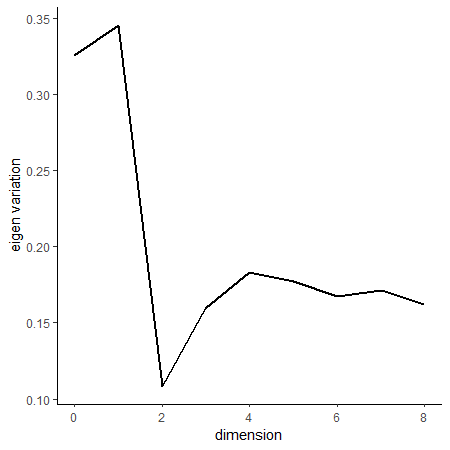


Used $h=1$ for order determination, 200 samples for Ladle and PA.


---
class: ani-slide
# K-mean Tuning for $h$
 
<iframe src="images/tuning_sc.html" width="100%" height="95%" frameborder="0" ></iframe>


---
count: false
class: left, top
# Simulations - tuning and estimation

Conventional suggestion: $h = 2.34 n^{-1/(p+6)} \approx 1.66$;

K-fold K-means Tuning: $h \approx 1.25$;


--

Using $h \approx 1.25$ to estimate OPCG $\hat \beta_{opcg}$:

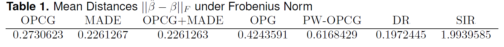

--

  - PW-OPCG estimates 2 SDR directions per pair of classes \{1,2\}, \{1,3\}, and \{2,3\}, for 6 total, and selects the 2 that explain the most variation. 

    - Adragni's suggestion for multi-class problems.
    
  - DR is Directional Regression `r Cite(bib_sdr, author=c("li"), title="directional")`  
---
count: false
class: left, top
# Simulations - Sufficient Predictors $\hat \beta^\top X^{test}$

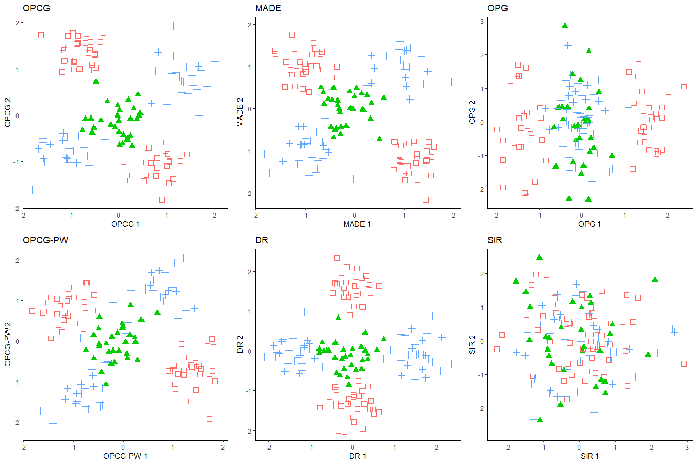


---
class: left, top
# Ordinal-Categorical Data Analysis

We analyze two continuous response datasets that we discretize in ordinal-categorical response datasets: 

  <!-- - Red Wine Quality - UCI -->

  <!--   - p=11; n=1599; Ordinal response - Wine Quality Score; -->
  
  <!-- - Wisconsin Eye Disease -->

  <!--   - p=10;  n=294;  -->
  <!--   - Ordinal response - severity of coronary artery disease (1 = no disease; 2 = degree 1; 3 = degree 2; 4 = degree 3; 5 = degree 4); Classes: 1,2,3,4 -->

  <!-- - Boston Housing Prices - 'spData' R package -->

  <!--   - p=13; n=506; resp=Median value of homes;  -->
    
  - Communities and Crime Rate - UCI

    - p=99; n=1994; resp=pop. crime. rate

  - Superconductors - UCI

    - p=81; n=2000; resp=crit. temp. of superconductors

    
  <!-- - Panel Study of Income Dynamics 1976 (psid76) -->

  <!--   - p=20; n=753 -->
  <!--   - Ordinal response - Family Income; Classes: 1,2,3,4,5; -->


<!-- --- -->
<!-- class: left, top -->
<!-- # Ordinal Classification Error using MCOSVM -->

<!-- - MCOSVM `r Cite(bib_opg, author=c("Waegeman"), title="ensemble")` : $m-1$ SVMs on all binary classifications $I\{ Y > l\}$; construct estimated probabilities of $P\{Y=l\}$; highest probability is predicted class.   -->

<!-- -- -->

<!-- 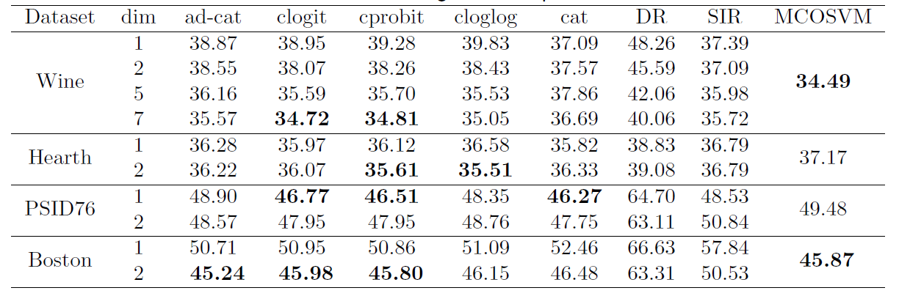 -->


<!-- --- -->
<!-- count: false -->
<!-- class: left, top -->
<!-- # Red Wine Quality -->


<!-- 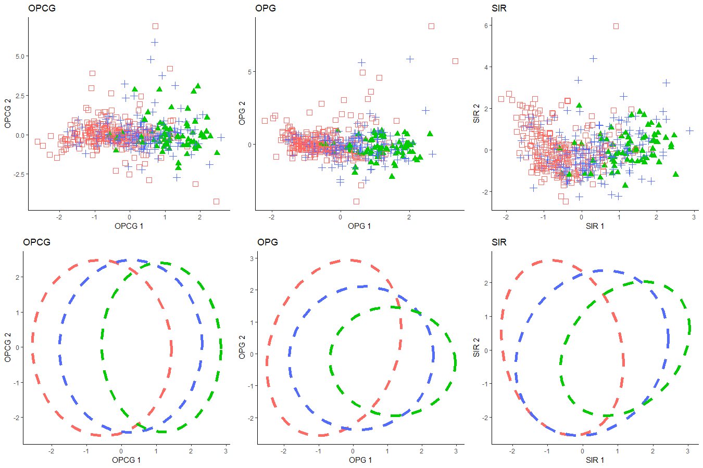 -->


<!-- --- -->
<!-- class: left, top -->
<!-- # Wisconson Eye Disease  -->


<!-- 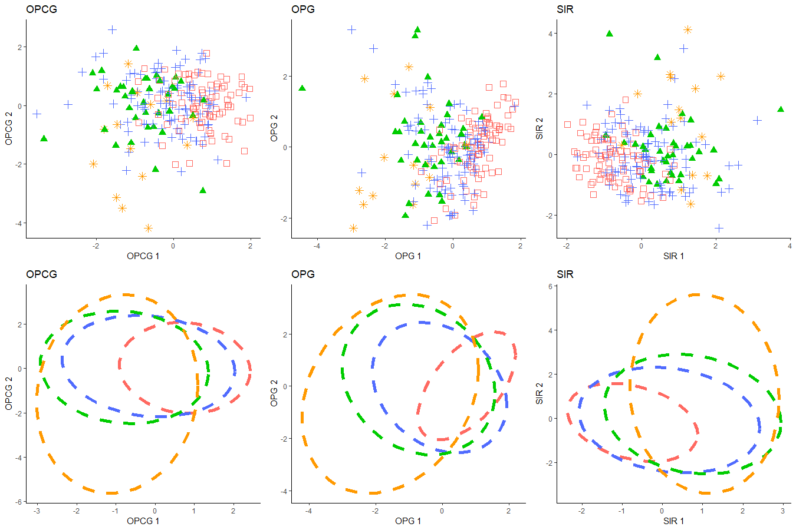 -->


<!-- --- -->
<!-- class: left, top -->
<!-- # Boston Housing Prices -->

<!-- 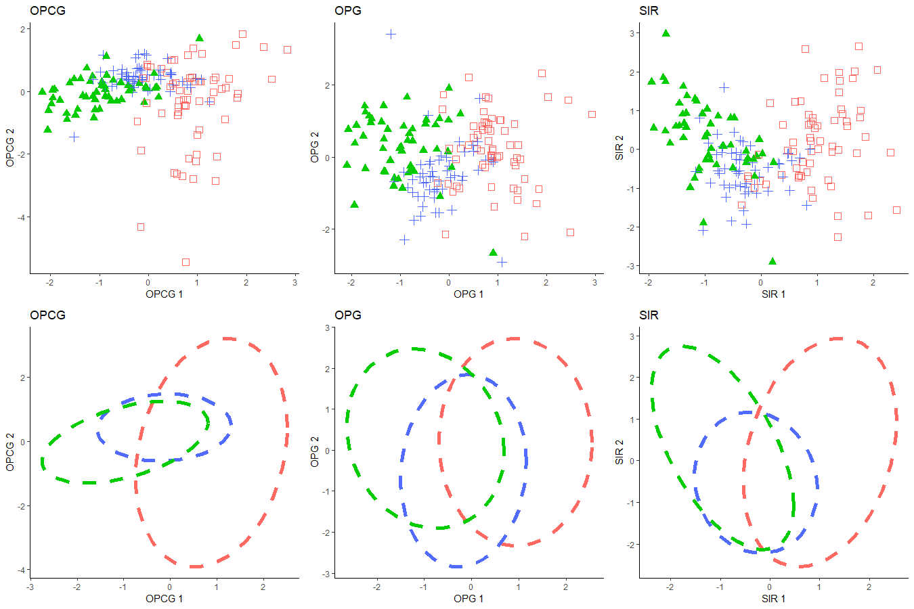 -->

<!-- --- -->
<!-- class: left, top -->
<!-- # PSID 76 -->

<!-- 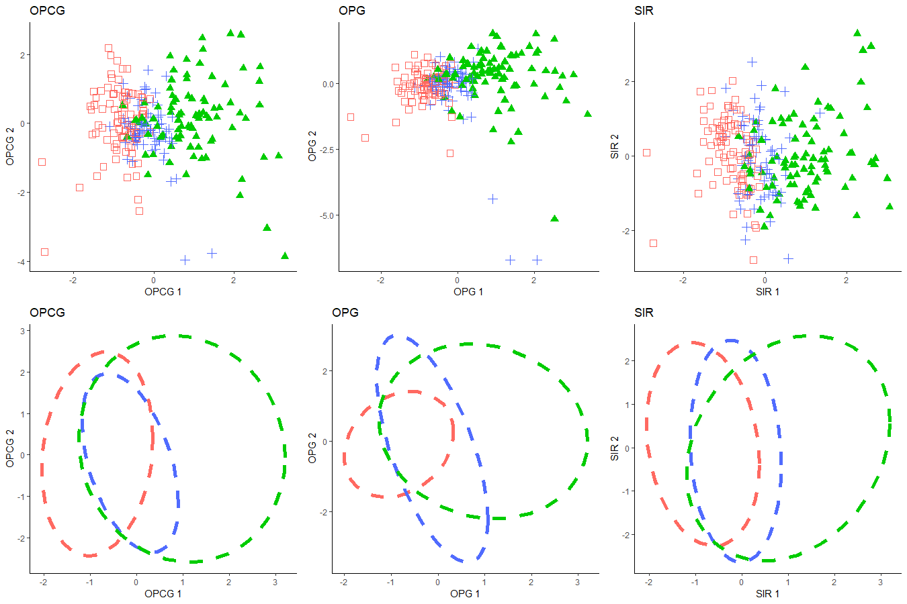 -->


---
class: left, top
# Communities and Crime Rate in the US

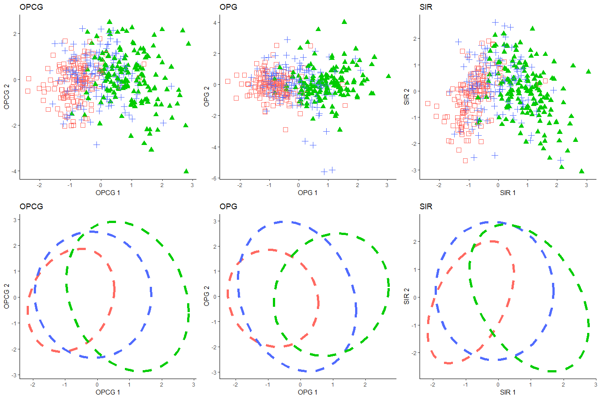

---
class: left, top
# Crit. Temperature of Superconductors

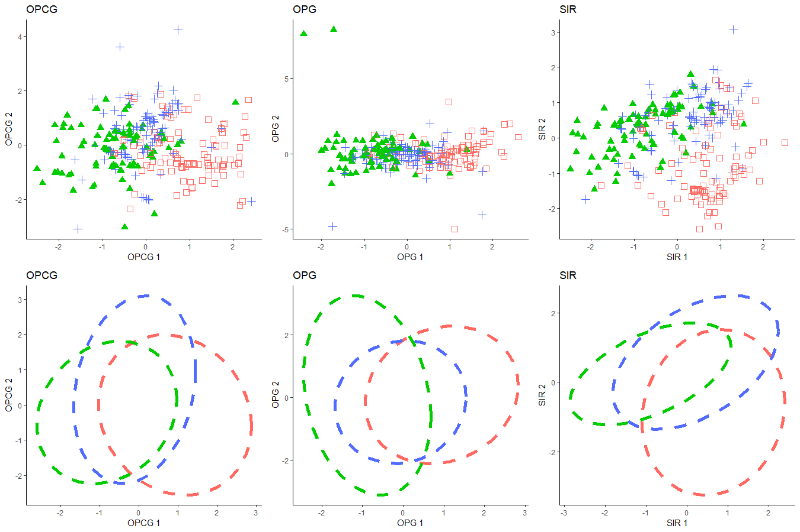


---
class: left, top
# Categorical Data Analysis  

We analyze three datasets with categorical responses: 

  - Handwritten Digits (Pendigit) from UCI
  
    - p=16; n=2000; resp=0-9
    
  - USPS Handwritten Digits  
  
    - p=256; n=2007; resp=0-9
    
  - ISOLET from UCI
  
    - p=618; n=6334/1553; resp=a-z

---
class: left, top
# Categorical Classification Error using SVM

.center[
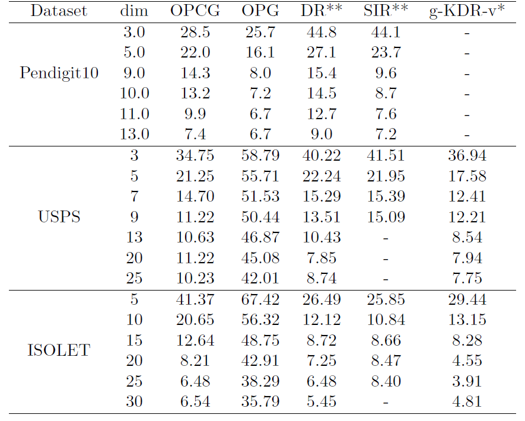
]

---
class: ani-slide
# Pen Digit 10 - SIR/DR - 1,6,7,9
<iframe src="images/dr_pendigit4.html" width="100%" height="95%" frameborder="0"></iframe>

---
count: false
class: ani-slide
# Pen Digit 10 - OPCG - 1,6,7,9

<iframe src="images/opcg_pendigit4.html" width="100%" height="95%" frameborder="0"></iframe>

<!-- --- -->
<!-- class: ani-slide -->
<!-- # Pen Digit 10 - SIR/DR - 3,5,8,9 -->
<!-- <iframe src="images/dr_pendigit4-2.html" width="100%" height="95%" frameborder="0"></iframe> -->

<!-- --- -->
<!-- count: false -->
<!-- class: ani-slide -->
<!-- # Pen Digit 10 - OPCG - 3,5,8,9 -->

<!-- <iframe src="images/opcg_pendigit4-2.html" width="100%" height="95%" frameborder="0"></iframe> -->


---
class: left, top, inverse
# .bg-text[Conclusion]


1. Provided the Multivariate Link Functions for Ordinal-Categorical Responses.

--

2. Generalized OPG to linear exponential families 

--

3. Introduced a K-means tuning procedure for classifcation

--

4. Demonstrated the effectiveness of OPCG in categorical and ordinal classification problems.

  - Can handle multiple labels simultaneously 
  
  - Noticeable improvement over OPG for larger $p$ 


---
layout: false
# References

```{r, echo=FALSE, results="asis"}
PrintBibliography(bib_sdr, start=1, end=6)
```

---
layout: false
# References

```{r, echo=FALSE, results="asis"}
PrintBibliography(bib_sdr, start=7, end=12)
```

---
layout: false
# References

```{r, echo=FALSE, results="asis"}
PrintBibliography(bib_sdr, start=13)
```


