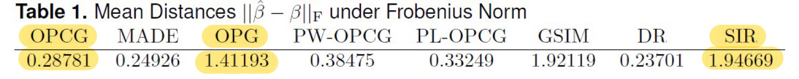

--- 
title: "Forward Sufficient Dimension Reduction for Categorical and Ordinal Responses"
# subtitle: "with Multinomial Response"
author: "Harris Quach"
institute: "Pennsylvania State University"
date: "2021/06/10 (updated: `r Sys.Date()`)"
output:
  xaringan::moon_reader:
    lib_dir: libs
    css: [xaringan-themer.css, "mytheme.css"]
    # "hygge-duke","cols.css", "ninjutsu" ,"assets/ninpo.css", 
    nature:
      highlightStyle: github
      highlightLines: true
      countIncrementalSlides: false
      # beforeInit: "my_macros.js" # Macros File
      # For Live Preview, run xaringan::inf_mr() in console
    # toc: true
    # toc_depth: 3
    includes:
      before_body: local_tex.html
    seal: false
   
# "rutgers-fonts","rutgers", "hygge", "shinobi"

---

```{r xaringan-themer, include = FALSE}

library(xaringanthemer)

style_xaringan(
  text_color = "#000",
  header_color = "#2d60ba",
  background_color = "#FFF",
  link_color = "rgb(249, 38, 114)",
  text_bold_color = "#2d60ba", 
  padding = "16px 64px 16px 64px", 
  code_highlight_color = "rgba(255,255,0,0.5)",
  code_inline_color = "#000",
  code_inline_background_color = NULL,
  code_inline_font_size = "1em",
  inverse_background_color = "#1e407c",
  inverse_text_color = "#d6d6d6",
  inverse_text_shadow = FALSE, 
  footnote_color = NULL,
  footnote_font_size = "0.9em",
  footnote_position_bottom = "60px",
  left_column_subtle_color = "#777",
  left_column_selected_color = "#000",
  blockquote_left_border_color = "lightgray",
  table_border_color = "#666",
  table_row_border_color = "#ddd",
  table_row_even_background_color = "#eee",
  base_font_size = "20px",
  text_font_size = "1rem",
  header_h1_font_size = "1.5rem",
  header_h2_font_size = "1.25rem",
  header_h3_font_size = "1.25rem", 
  header_background_ignore_classes = c("normal", "inverse", "title", "middle",
                                       "bottom"),
  text_slide_number_font_size = "0.9em", 
  extra_css = list("h2" = list("color" = "#9ab6e7")  #03A696;
  ), 
  outfile = "xaringan-themer.css"
)
```

```{r, load_refs, include=FALSE, cache=FALSE}
library(RefManageR)
BibOptions(check.entries = FALSE,
           bib.style = "authoryear",
           cite.style = "text",
           style = "markdown",
           hyperlink = FALSE,
           dashed = FALSE)
bib_sdr <- ReadBib("bib_sdr.bib",
                   check = FALSE)
bib_opg <- ReadBib("bib_opg.bib",
                   check = FALSE)
```
 

<!-- class: title-slide -->

# Forward Sufficient Dimension Reduction for Categorical and Ordinal Responses
<!-- # .bg-text[Generalized Forward Sufficient Dimension Reduction for Classification] -->
<!-- <hr width="700" align="left" /> -->
<hr/>

Harris Quach (joint work with Dr. Bing Li) <br/> Date: "2021/06/10 (updated: `r Sys.Date()`)"

---
class: inverse, middle

<!-- inverse makes the background black and text white -->

# .bg-text.center[Overview]  

.md-text[
  
1. We show ordinal variables are linear exponential families
  
2. We generalize a popular SDR method to linear exponential families
  
3. We proposed a K-means tuning procedure
  
]
 

<!-- --- -->
<!-- class: left, top -->
<!-- # Multivariate Links for Linear Exponential Families -->

<!-- The crux of our proposed method is fitting a multivariate Generalized Linear Model to categorical or ordinal response variables, $Y$, which are linear exponential families. -->

<!-- - Linear exponential families have log-likelihood of the form -->

<!-- \begin{align*} -->
<!-- \ell(\theta;y) = \theta^\top y - b(\theta);    -->
<!-- \end{align*} -->

<!-- - They are characterized by their means $\mu$, through the canonical parameter $\theta$, using  -->

<!--   - the canonical link function $\theta( \cdot ): \mu \mapsto \theta$;  -->
<!--   - the inverse canonical link $\mu(\cdot): \theta \mapsto \mu$;  -->
<!--   - the cumulant generating function $b(\cdot)$. -->

<!-- --- -->
<!-- class: left, top -->
<!-- # Categorical Response -->

<!-- Suppose $Y \in \{1,...,m\}$ is a categorical variable for $m$ nominal categories.  -->

<!-- - We can represent $Y$ as a vector $S = (S^1,...,S^{m-1}) \in \{0,1\}^{m-1}$ -->

<!--   - we set $S^m = 1 - \sum_{j=1}^{m-1} S^m$. -->

<!--   - If $Y=k$, then $S^k = 1$ and $S^j=0$ for $j \neq k$.  -->

<!--   - Eg. $m=3$; if $Y = 2$, then $S = (0,1)$; if $Y=3$, then $S=(0,0)$.  -->


<!-- --- -->
<!-- count: false -->
<!-- class: left, top -->
<!-- # Categorical Response -->

<!-- Suppose $Y \in \{1,...,m\}$ is a categorical variable for $m$ nominal categories.  -->

<!--   - We can represent $Y$ as a vector $S = (S^1,...,S^{m-1}) \in \{0,1\}^{m-1}$ -->

<!--   - Let $p = (p^1,...p^{m-1})$ be the $m-1$ probabilities for each category.  -->
<!--   The canonical link of and its inverse is are the multivariate logit and expit functions: -->

<!-- \begin{align*} -->
<!-- \theta(p) = \log \frac{ p }{ 1 - \boldsymbol{1}^{\top} p } -->
<!-- \qquad -->
<!-- p(\theta) =  \frac { \exp(\theta) } {  1 - \boldsymbol{1}^{\top} \exp( \theta) }  -->
<!-- \end{align*} -->

<!-- The multinomial log-likelihood of $S$ is  -->
<!-- \begin{align*} -->
<!-- \ell(\theta;S) = \theta^{\top}S - \log ( 1 + \boldsymbol 1^{\top}  e^\theta   ) -->
<!-- , -->
<!-- \end{align*} -->
<!-- where  -->
<!-- $b(\theta) = \log( 1 + \boldsymbol{1}^{\top} e^{  \theta }  )$. -->


<!-- --- -->
<!-- class: left, top -->
<!-- # Ordinal Response -->

<!-- Suppose $Y \in \{1,...,m\}$ is an ordinal-categorical variable for $m$ ordered categories.   -->

<!-- - We can represent $Y$ as a vector $S = (S^1,...S^{m-1}) \in \{0,1\}^{m-1}$ as for categorical $Y$.  -->

<!-- - We can represent $S$ as a vector $T = (T^1,...T^{m-1}) \in \{0,1\}^{m-1}$, and we set $T^{m} = 0$ and $T^0=1$.  -->

<!--   - If $Y = k$, then $T^j = 1$ for $j \leq {k-1}$ and $T^j=0$ for $j > k-1$. -->

<!--   - We can interpret $T^j = I\{Y > j\}$ -->

<!--   - Eg. $m=5$; if $Y=3$, then $T=(1,1,0,0)$; if $Y=1$, then $T=(0,0,0,0)$ -->


---
class: left, top
# Categorical and Ordinal-Categorical Variables

We consider response variables $Y$ that are categorical or ordinal in nature.

  - Eg. Categorical $Y$: digits 0-9, alphabet a-z; 
  - Eg. Ordinal $Y$: wine quality 0-9, ratings/review 1-5; 

Categorical variables are linear exponential families because they are a special case of the multinomial

  - the multivariate Logistic and Expit functions are the canonical and inverse canonical links

**We show Ordinal variables can be represented explicitly as a linear exponential family**

  - the multivariate **Adjacent Categories** logistic link is the canonical link.
  - we compute the inverse canonical link and cumulant generating function explicitly.

<!-- We say the random vector $T$ has a **ordinal-categorical (Or-Cat)** distribution. -->
<!-- The ordinal-categorical distribution is a linear exponential family with the **adjacent-categories (Ad-Cat)** canonical link function  -->
<!-- \begin{align*} -->
<!-- \theta(\tau)  -->
<!-- = -->
<!-- \log \left\{ \mathrm{diag}[ (P^{-1} - I)\tau ]^{-1} (P^{-1} - I)\tau \right \}. -->
<!-- \end{align*} -->
<!-- and inverse canonical link function -->
<!-- \begin{align*} -->
<!-- \tau(\theta) -->
<!-- =\frac{Q P  L \exp (L \theta ) }{1 + e_1^{\top} P   L \exp (L \theta ) } -->
<!-- , -->
<!-- \end{align*} -->
<!-- with log-likelihood -->
<!-- \begin{align*} -->
<!-- \ell(\theta; T) -->
<!-- = \theta^{\top} T - \log ( 1 + e_{1}^{\top}  P   L \exp (L \theta ) )   -->
<!-- , -->
<!-- \end{align*} -->
<!-- where -->
<!-- $b(\theta) = \log ( 1 + e_{1}^{\top}  P   L \exp (L \theta ) )$. -->

---
count: false
class: inverse, center, middle

# .bg-text[Inverse and Forward Linear SDR]  

---
class: left, top
# Why Sufficient Dimension Reduction? 


Suppose we have a large dataset with some response $Y \in \R^m$ and predictors $X \in \R^p$.

  - When $p$ is large, lower dimensional summaries of $X$ are helpful for visualization and application of conventional statistical methods

  - Finding a linear lower dimensional summary of $X$ means finding $\beta \in \R^{p \times d}$, where $d < p$, in order to construct the lower dimensional summary $\beta^\top X$
  
  - Sufficient Dimension Reduction (SDR) are approaches for finding $\beta$ such that $\beta^\top X$ retains all relevant information about $Y$
  
  - Inverse and Forward SDR describe general SDR approaches for finding such a dimension reduction $\beta$


---
class: left, top
# Motivating Example: 

Consider a response $Y$ and predictor $X = (X_1, X_2) \in [0,1]^2$. 
Let $Y=X_1^2$.
Then $Y= (\beta^\top X)^2$, where $\beta = (1,0) \in \R^2$. 
- we want to recover $span(\beta) = \{ (c,0): c \in \R\}$.
.center[

]


---
class: left, top <!-- formatting the slide -->

<!-- the title --> 

# Motivating Example: 
## Inverse Regression for SDR - Sliced Inverse Regression `r Cite(bib_sdr, author="Li", title="Sliced", year="1991")`

.center[

]

<!-- <iframe src="images/almost_sir.html" width="90%" height="90%" frameborder="0"></iframe> -->


---
count: false
class: left, top <!-- formatting the slide -->

<!-- the title --> 

# Motivating Example: 
## Inverse Regression for SDR - Sliced Inverse Regression `r Cite(bib_sdr, author="Li", title="Sliced", year="1991")`

.center[

]

---
count: false
class: left, top <!-- formatting the slide -->

<!-- the title --> 

# Motivating Example: 
## Inverse Regression for SDR - Sliced Inverse Regression `r Cite(bib_sdr, author="Li", title="Sliced", year="1991")`

.center[

]

---
count: false
class: left, top <!-- formatting the slide -->

<!-- the title --> 

# Motivating Example: 
## Inverse Regression for SDR - Sliced Inverse Regression `r Cite(bib_sdr, author="Li", title="Sliced", year="1991")`

.center[

]

---
count: false
class: left, top <!-- formatting the slide -->

<!-- the title --> 

# Motivating Example: 
## Inverse Regression for SDR - Sliced Inverse Regression `r Cite(bib_sdr, author="Li", title="Sliced", year="1991")`

.center[

]
--

  - 'Inverse' because we estimate $E(X|Y)$.

---
class: left, top <!-- formatting the slide -->

<!-- the title --> 

# Motivating Example: 
## Inverse Regression for SDR - Drawbacks

.center[

]

---
count: false
class: left, top  

# Motivating Example: 
## Inverse Regression for SDR - Drawbacks

.center[

] 

---
count: false
class: left, top  

# Motivating Example: 
## Inverse Regression for SDR - Drawbacks

.center[

] 

---
count: false
class: left, top  

# Motivating Example: 
## Inverse Regression for SDR - Drawbacks

.center[

] 
--
- Inverse methods require assumptions on the support of the predictor.

---
class: left, top  

# Forward Regression for SDR
## Outer Product of Gradients (OPG) `r Cite(bib_sdr, author="Xia", title="adaptive")`

.center[

] 

---
count: false
class: left, top <!-- formatting the slide -->

<!-- the title --> 
 
# Forward Regression for SDR
## Outer Product of Gradients (OPG) `r Cite(bib_sdr, author="Xia", title="adaptive")`


.center[

] 

---
count: false
class: left, top <!-- formatting the slide -->

<!-- the title --> 
 
# Forward Regression for SDR
## Outer Product of Gradients (OPG) `r Cite(bib_sdr, author="Xia", title="adaptive")`
 

.center[

] 


---
count: false
class: left, top <!-- formatting the slide -->

<!-- the title --> 
 
# Forward Regression for SDR
## Outer Product of Gradients (OPG) `r Cite(bib_sdr, author="Xia", title="adaptive")`
 

.center[

] 

--
- "Forward" Regression because we are estimating $E(Y|x)$ and $\partial E(Y|x)/\partial x^\top$

---
count: false
class: left, top <!-- formatting the slide -->

<!-- the title --> 
 
# Forward Regression for SDR
## Outer Product of Gradients (OPG) `r Cite(bib_sdr, author="Xia", title="adaptive")`


.center[

] 

---
count: false
class: left, top <!-- formatting the slide -->

<!-- the title --> 
 
# Forward Regression for SDR
## Outer Product of Gradients (OPG) `r Cite(bib_sdr, author="Xia", title="adaptive")`


.center[

]  

 
---
class: left, top
# Forward Regression for SDR 


- OPG developed for scalar $Y$; may not work as well for categorical $Y$.

- **Idea: Estimate a GLM locally instead of a Linear Regression.**


.center[

]  


---
count: false
class: inverse, center, middle

<!-- inverse makes the background black and text white -->

# .bg-text[Outer Product of Canonical Gradients (OPCG)]  

---
class: left, top <!-- formatting the slide -->

<!-- the title --> 
 
# Generalized Forward Regression for SDR

.center[

]  

- In OPG, we fit a linear regression about $x_0$, i.e. we minimize
\begin{align*}
\{Y - a_0 + B_0^\top(X-x_0) \}^\top \{Y - a_0 + B_0^\top(X-x_0) \} 
\end{align*}
and estimate $\partial E(Y|x_0)/ \partial x^\top$ using $\hat B_0$. 
    <!-- $$\hat B_0 = \frac{ \widehat{ \partial E(Y|x_0)} }{\partial x^\top}.$$ -->


---
class: left, top 
 
# Generalized Forward Regression for SDR

.center[

]  

- Instead, fit a linear exponential family about $x_0$, i.e. minimize
\begin{align*}
  -\ell_0(a_0, B_0;Y,X,x_0)  = - [a_0 + B_0^\top(x-x_0)]^\top y + b[a_0 + B_0^\top(x-x_0)]  
\end{align*}
and use the estimate $\hat B_0$. 

---
class: left, top

# Outer Product of Canonical Gradients (OPCG)

Given a random sample $Y_{1:n}$, $X_{1:n}$, fit a local linear GLM about each $X_j$, for $j=1,...,n$, by minimizing the full negative local linear log-likelihood:
\begin{align*}
& L(a_1,..,a_n, B_1,...,B_n; X_{1:n}, Y_{1:n}) \\  
= & -\frac {1}{n} \sum_{j,i=1}^n
K \bigg ( \frac{X_i - X_j}{h} \bigg )\\
& \times 
\{[a_{j} + B_{j}^\top (X_i - X_j)]^\top Y_i - 
b(a_{j} + B_{j}^\top (X_i - X_j)) \} 
,
\end{align*}
where $b(\cdot)$ determines the GLM, and $K(\cdot)$ is a kernel weight with bandwidth $h$. 

--

This provides minimizers $\hat B_j$ that estimate $\partial \theta(X_j)/\partial x^\top$, which we use to construct the average outer product
$$\hat \Lambda_n = \frac 1n \sum_{j=1}^n \hat B_j \hat B_j^\top.$$ 

---
class: left, top

# The OPCG Estimator

The **Outer Product of Canonical Gradients (OPCG) Estimator** for $\beta$, $\hat \beta_{opcg}$, is the first $d$ eigenvectors of 
$$\hat \Lambda_n = \frac 1n \sum_{j=1}^n \hat B_j \hat B_j^\top,$$ 
corresponding to the $d$ largest eigenvalues.

.center[
<!--  -->

] 

---
class: left, top 
# Properties related to OPCG

  - OPCG is consistent:
  
  <div class="theorem">
  Under some regularity assumptions, as \( n \to \infty\), we have
  \begin{align*} 
  \| \hat \beta_{opcg}  - \beta \|_F = O_{a.s}
  ( h + h^{-1} \delta_{ph} + \delta_{n} )
  ,
  \end{align*} 
  where \(\delta_{ph} = \sqrt{ \frac{\log n}{ nh^p} }\),
  \(\delta_{n} = \sqrt{ \frac{\log n}{ n } }\),
  \(  h \downarrow 0\), and
  \( h^{-1}\delta_{ph} \to 0\).
  </div>
  
  - Can be implemented using Newton-Raphson

  - Ladle and Predictor Augmentation methods are fast, eigen-based methods that can be applied to estimate $d$. `r Citep(bib_sdr, author=c("luo"),title=c("combining", "augmentation"))`

  - **For the bandwidth $h$,  we propose a K-means approach for tuning that selects $h$ by minimizing an F-ratio.**
    - Cross Validation or Optimal bandwidths can be used as well. 
    
---
count: false
class: inverse, center, middle

<!-- inverse makes the background black and text white -->

# .bg-text[Simulations and Data Analyses]

--
.left[

1. Goal: generalize OPG to Categorical and Ordinal-Categorical Responses

2. Categorical and Ordinal-Categorical variables are linear exponential families
 
3. Proposal: OPCG generalizes OPG to linear exponential families

]

---
class: left, top
# OPCG Procedure

Given data:

  1. Simulations: we have 3 data sets
  
    - Training set used for estimating $\hat \beta_{opcg}$; 
    
      - Used for estimating $d$ as well.
      
    - Tuning set used for tuning bandwidth $h$
    
    - Testing set used for assessing performance
  
  2. Applications: Data is split into two sets:
  
    - Training set used for estimating $\hat \beta_{opcg}$; 
    
      - Used for estimating $d$ as well.
      
      - Used K-fold tuning procedure for bandwidth $h$
      
    - Testing set used for assessing performance


---
class: left, top
# Simulations


Our predictor will be $X=(X^1,X^2,X^3,...,X^{10}) \in \R^{10}$.

  - We generate generate 5 clusters from a bivariate normal $(X^1, X^2)$, augmented with 8 standard normals for random noise, $(X^3,...,X^{10})$.

  - Two clusters are labelled 1, two are labelled 2, and one cluster is labelled 3; So $Y \in \{1,2,3\}$ is categorical.
 
  - We draw an equal number of observations from each cluster for the training set, tuning set and testing set.
 

---
class: ani-slide
# K-mean Tuning for $h$
 
<iframe src="images/tuning_sc.html" width="100%" height="95%" frameborder="0" ></iframe>


---
count: false
class: left, top
# Simulations - tuning and estimation

Conventional suggestion: $h = 2.34 n^{-1/(p+6)} \approx 1.66$;

K-fold K-means Tuning: $h \approx 1.25$;


--

Using $h \approx 1.25$ to estimate OPCG $\hat \beta_{opcg}$:



---
class: left, top
# Categorical Data Analysis  

We analyze three datasets with categorical responses: 

  - Handwritten Digits (Pendigit) from UCI
  
    - p=16; train/test=1333/667; resp=0-9
    
  - USPS Handwritten Digits  
  
    - p=256; train/test=1338/669; resp=0-9
    
  - ISOLET from UCI
  
    - p=618; train/test=6334/1553; resp=a-z

---
class: left, top
# Categorical Classification Error using SVM

.center[

]

---
class: left, top, inverse
# .bg-text[Conclusion]


1. Generalized OPG to linear exponential families 

2. Demonstrated a K-means tuning procedure for classification

3. Demonstrated the effectiveness of OPCG in categorical classification problems.

  - Can handle multiple labels simultaneously 
  
  - Noticeable improvement over OPG for larger $p$ 


---
class: middle, center, inverse
#Dedicated To

.bg-text[Donald Alexander Stuart Fraser]


*In Memory of his infectious passion for statistics, immense patience with students, and prevalent use of pictures for complex concepts.* 

.center[

]

April 29, 1925 - December 21, 2020


---
layout: false
# References

```{r, echo=FALSE, results="asis"}
PrintBibliography(bib_sdr, start=1, end=4)
```

<!-- --- -->
<!-- layout: false -->
<!-- # References -->

<!-- ```{r, echo=FALSE, results="asis"} -->
<!-- PrintBibliography(bib_sdr, start=7, end=12) -->
<!-- ``` -->

<!-- --- -->
<!-- layout: false -->
<!-- # References -->

<!-- ```{r, echo=FALSE, results="asis"} -->
<!-- PrintBibliography(bib_sdr, start=13) -->
<!-- ``` -->


