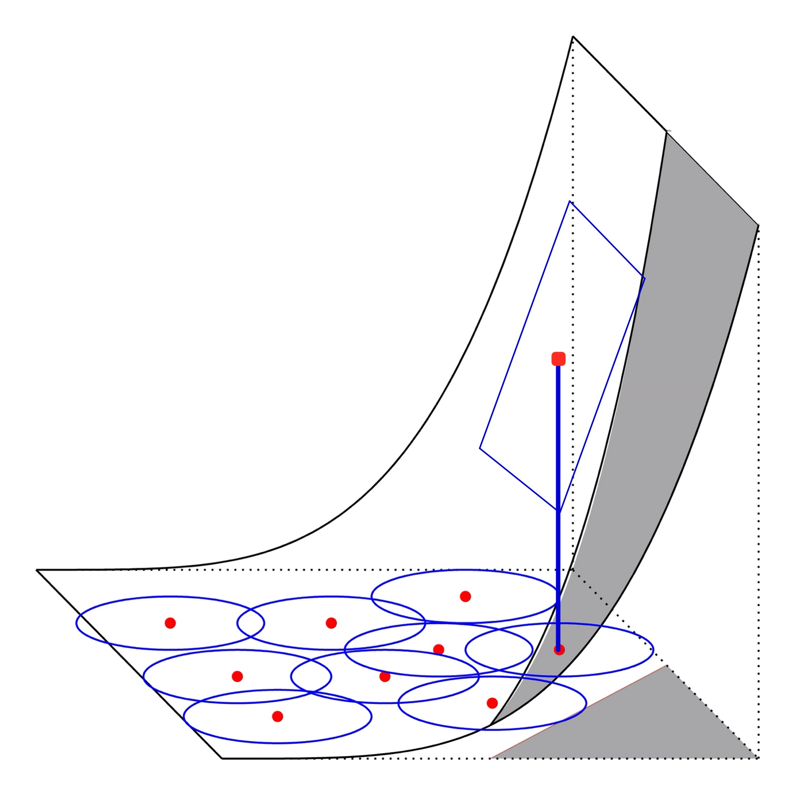
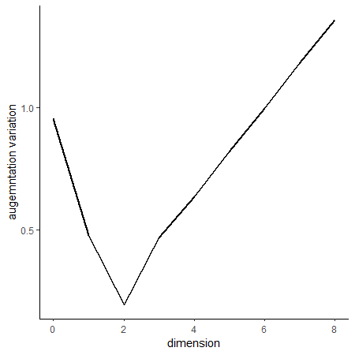
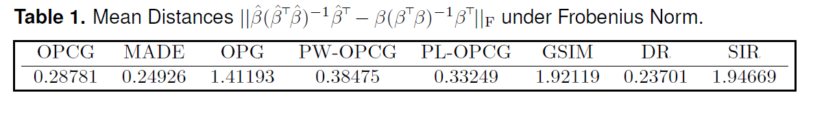
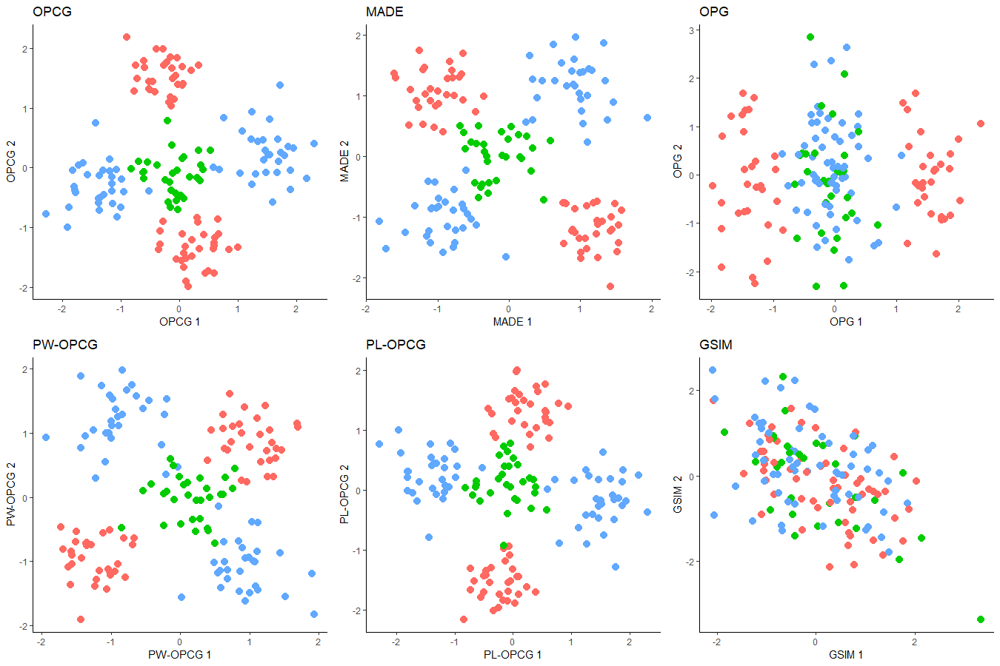
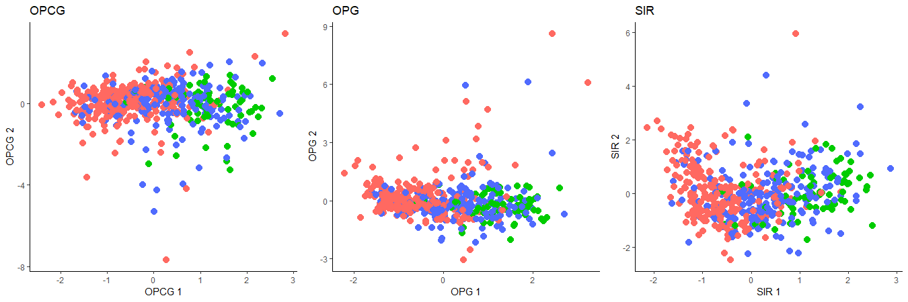
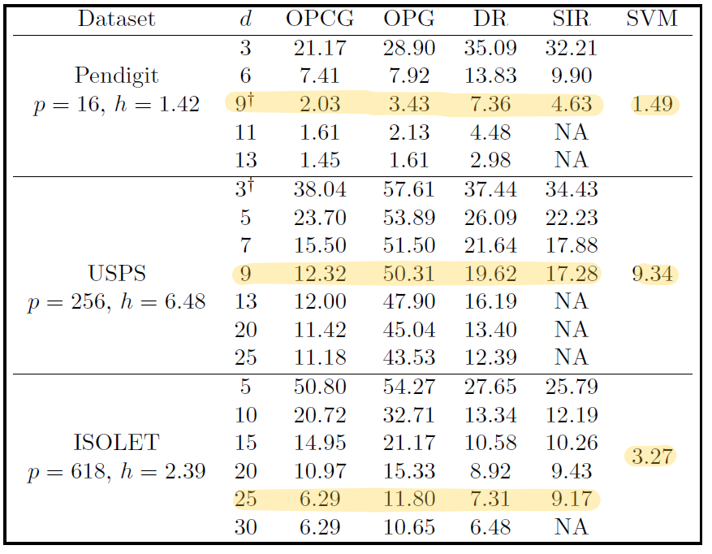
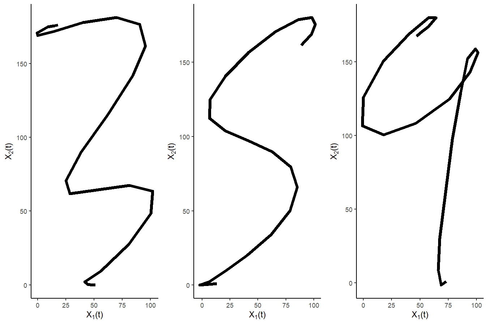
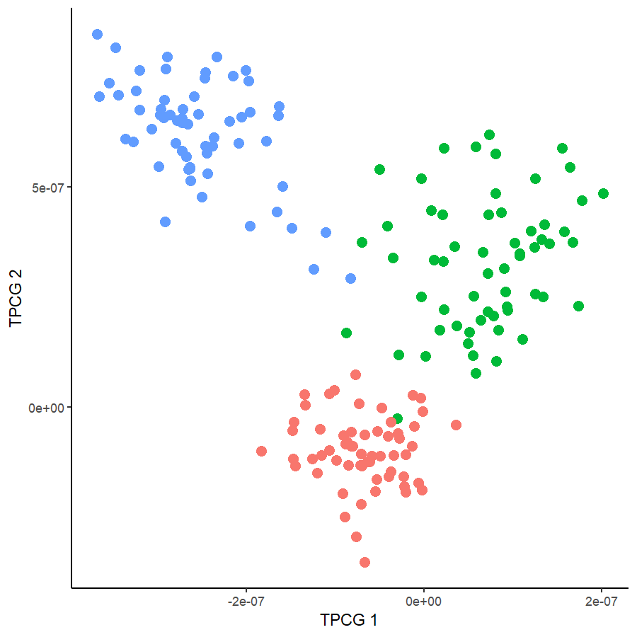
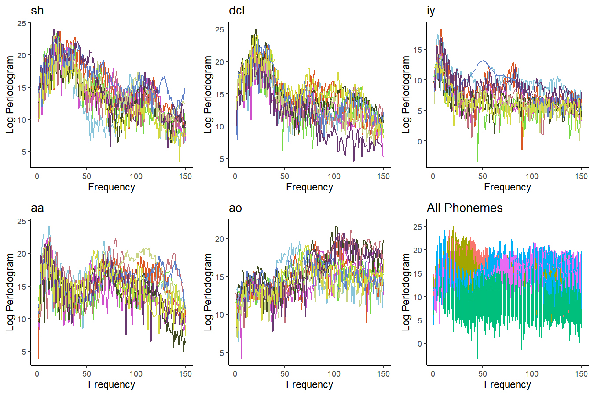
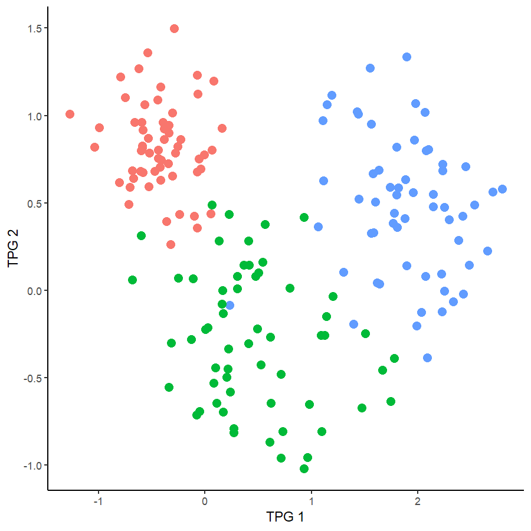

--- 
title: "Advances in Forward Sufficient Dimension Reduction for Statistical Learning"
# subtitle: "with Multinomial Response"
author: "Harris Quach"
institute: "Pennsylvania State University"
date: "2021/07/16 (updated: `r Sys.Date()`)"
output:
  xaringan::moon_reader:
    lib_dir: libs
    css: [xaringan-themer.css, "mytheme.css"]
    # "hygge-duke","cols.css", "ninjutsu" ,"assets/ninpo.css", 
    nature:
      highlightStyle: github
      highlightLines: true
      countIncrementalSlides: false
      # beforeInit: "my_macros.js" # Macros File
      # For Live Preview, run xaringan::inf_mr() in console
    # toc: true
    # toc_depth: 3
    includes:
      before_body: local_tex.html
    seal: false
   
# "rutgers-fonts","rutgers", "hygge", "shinobi"

---

```{r xaringan-themer, include = FALSE}

library(xaringanthemer)

style_xaringan(
  text_color = "#000",
  header_color = "#2d60ba",
  background_color = "#FFF",
  link_color = "rgb(249, 38, 114)",
  text_bold_color = "#2d60ba", 
  padding = "16px 64px 16px 64px", 
  code_highlight_color = "rgba(255,255,0,0.5)",
  code_inline_color = "#000",
  code_inline_background_color = NULL,
  code_inline_font_size = "1em",
  inverse_background_color = "#1e407c",
  inverse_text_color = "#d6d6d6",
  inverse_text_shadow = FALSE, 
  footnote_color = NULL,
  footnote_font_size = "0.9em",
  footnote_position_bottom = "60px",
  left_column_subtle_color = "#777",
  left_column_selected_color = "#000",
  blockquote_left_border_color = "lightgray",
  table_border_color = "#666",
  table_row_border_color = "#ddd",
  table_row_even_background_color = "#eee",
  base_font_size = "20px",
  text_font_size = "1rem",
  header_h1_font_size = "1.5rem",
  header_h2_font_size = "1.25rem",
  header_h3_font_size = "1.25rem", 
  header_background_ignore_classes = c("normal", "inverse", "title", "middle",
                                       "bottom"),
  text_slide_number_font_size = "0.9em", 
  extra_css = list("h2" = list("color" = "#9ab6e7")  #03A696;
  ), 
  outfile = "xaringan-themer.css"
)
```

```{r, load_refs, include=FALSE, cache=FALSE}
library(RefManageR)
BibOptions(check.entries = FALSE,
           bib.style = "authoryear",
           cite.style = "text",
           style = "markdown",
           hyperlink = FALSE,
           dashed = FALSE)
bib_sdr <- ReadBib("bib_sdr.bib",
                   check = FALSE)
bib_opg <- ReadBib("bib_opg.bib",
                   check = FALSE)
bib_funsdr <- ReadBib("bib_funsdr.bib",
                   check = FALSE)
```
 

<!-- class: title-slide -->

# Developments in Forward Sufficient Dimension Reduction 


<hr/>
## Harris Quach (joint work with Dr. Bing Li) <br/> Date: 2021-07-19 (updated: `r Sys.Date()`)

---
class: left, middle
# Acknowledgements

I would like to thank my committee members for their time and support:

  - Bing Li
  - Bharath K. Sriperumbudur
  - Yanyuan Ma
  - Alexei Novikov


---
class: inverse, middle

<!-- inverse makes the background black and text white -->

# .bg-text.center[Overview]  

.md-text[
  
1. <span style="color:white"><b>Forward Sufficient Dimension Reduction for Categorical and Ordinal Response</b></span>
  
2. Forward Sufficient Dimension Reduction for Categorical and Ordinal Response with functional predictor
  
3. Forward Sufficient Dimension Reduction for functional response with functional predictor
  
]


---
class: left, top
# What is Sufficient Dimension Reduction? 


Suppose we have a large dataset with some response $Y \in \R^m$ and predictors $X \in \R^p$.

  - When $p$ is large, lower dimensional summaries of $X$ are helpful for visualization and application of conventional statistical methods

  - Finding a lower dimensional summary of $X$ means finding $\beta \in \R^{p \times d}$, where $d < p$, in order to construct the lower dimensional summary $\beta^\top X$
  
  - Sufficient Dimension Reduction (SDR) are approaches for finding $\beta$ such that $\beta^\top X$ retains all relevant information about $Y$
  
  - Inverse and Forward SDR describe general SDR approaches for finding such a dimension reduction $\beta$
  
  - $\beta$ can preserve different information by satisfying different criteria.

---
class: left, top
# Central Subspaces

The information preserved by $\beta$ is characterized by conditional independence:

  - $Y \indep X | \beta^\top X$; `r Cite(bib_sdr, author="Li", title="dimension", year="2018")`
    - $\beta$ preserves all information between $Y$ and $X$ and $\mathrm{span}(\beta)$ is an SDR subspace for $Y|X$; the smallest such subspace is called the **Central Subspace**. 

  - $Y \indep E(Y|X) | \beta^\top X$; `r Cite(bib_sdr, author=c("ma", "Li"), title="mean")`
    - $\beta$ preserves all information between $Y$ and $E(Y|X)$ and $\mathrm{span}(\beta)$ is an SDR subspace for $E(Y|X)$; the smallest such subspace is called the **Central Mean Subspace**. 

--

**NOTE**

We actually want the subspace generated by $\beta$, i.e. $\mathrm{span}(\beta)$.
  
  - **When we say we are estimating $\beta$, we mean estimating a basis for the subspace generated by $\beta$, i.e a basis for $\mathrm{span}(\beta)$.**
  
  
---
class: left, top
# Alternative Subspaces

The information preserved by $\beta$ is characterized by conditional independence:

  - $Y - E(Y|X) \indep \mathrm{Var}(Y|X) | \beta^\top X$; `r Cite(bib_sdr, author="zhu", title="variance", year="2009")`   
    - $\beta$ preserves all information between $Y - E(Y|X)$ and $\mathrm{Var}(Y|X)$; 
    <!-- the smallest such subspace is called the **Central Variance Subspace** -->
    
  - $Y  \indep Q_\tau(X) | \beta^\top X$; `r Cite(bib_sdr, author=c("kong", "li"), title=c("index", "functional"), year=c("2012", "2014") )`
    - $\beta$ preserves all information between $Y$ and $Q_\tau(X)=\inf\{y : P(Y \leq y |X) \geq \tau\}$; 
    <!-- the smallest such subspace is called the **Central $\tau$-th Quantile Subspace**   -->
  
  - $Y  \indep \theta(X) | \beta^\top X$; `r Cite(bib_sdr, author=c("li"), title=c("functional"), year=c("2014") )`
    - $\beta$ preserves all information between $Y$ and $\theta(X)$, where $\theta(X)$ is defined through a conditional statistical functional; 
    
  - $N(B_1),\ldots, N(B_k)  \indep X(B_1),\ldots,X(B_k) | \beta^\top X(B_1),\ldots,\beta^\top X(B_k)$; `r Cite(bib_sdr, author=c("guan"), title=c("spatial"), year=c("2010") )`
    - $\beta$ preserves all information between the counting process $N$ and the Gaussian random field $X$ over sets $B_1,\ldots,B_k$;  


---
class: left, top
# Recent Advances in SDR

  - Semi-parametric efficient SDR `r Cite(bib_sdr, author=c("ma", "zhu"), title=c("semiparametric", "efficient", "mean") )`  
  
  - gradient-based SDR using RKHS `r Cite(bib_sdr, author=c("fukumizu"), title=c("gradient") )`
  
  - Ladle and Predictor Augmentation Estimator for $d$ `r Cite(bib_sdr, author=c("luo"), title=c("augmentation", "combining") )`  

  - Nonlinear SDR `r Cite(bib_sdr, author=c("lee"), title=c("nonlinear") )`  
  - Nonlinear and Linear Functional SDR `r Cite(bib_funsdr, author=c("song"), title=c("functional") )`  

  - Post-dimension Reduction Inference `r Cite(bib_sdr, author=c("kim"), title=c("post") )`  
  

---
class: left, top
# Why Sufficient Dimension Reduction? 

<blockquote>
"...I’ve never been comfortable with the way in which
our discipline has embraced sparsity to the exclusion of
everything else. I mentioned before that I like the availability
of options in statistics, but for a long time now the
prevailing attitude toward high-dimensional problems has
been that its natural to assume sparsity. I find no sense in
which it’s natural. That overwhelming emphasis on sparsity
has, I think, kept us from seeing other solutions and
options. To be clear, I have nothing against sparsity per se,
and I think it’s a reasonable modeling construct. But it’s
not reasonable just because you have high-dimensional
data."  
.right[~ <cite>*Dennis Cook* (2021)</cite>]
.right[`r Cite(bib_sdr, author="Li", title="Cook", year="2021")`]
</blockquote>
  
  
---
class: inverse, center, middle

# .bg-text[Inverse and Forward Linear SDR]  

---
class: left, top
# Motivating Example: 

Consider a response $Y$ and predictor $X = (X_1, X_2) \in [0,1]^2$. 
Let $Y=X_1^2$.
Then $Y= (\beta^\top X)^2$, where $\beta = (1,0) \in \R^2$. 
- we want to recover $span(\beta) = \{ (c,0): c \in \R\}$; we take $d=1$ as known.
.center[

]


---
class: left, top <!-- formatting the slide -->

<!-- the title --> 

# Motivating Example: 
## Inverse Regression for SDR - Sliced Inverse Regression `r Cite(bib_sdr, author="Li", title="Sliced", year="1991")`

.center[

]

<!-- <iframe src="images/almost_sir.html" width="90%" height="90%" frameborder="0"></iframe> -->


---
count: false
class: left, top <!-- formatting the slide -->

<!-- the title --> 

# Motivating Example: 
## Inverse Regression for SDR - Sliced Inverse Regression `r Cite(bib_sdr, author="Li", title="Sliced", year="1991")`

.center[

]

---
count: false
class: left, top <!-- formatting the slide -->

<!-- the title --> 

# Motivating Example: 
## Inverse Regression for SDR - Sliced Inverse Regression `r Cite(bib_sdr, author="Li", title="Sliced", year="1991")`

.center[

]

---
count: false
class: left, top <!-- formatting the slide -->

<!-- the title --> 

# Motivating Example: 
## Inverse Regression for SDR - Sliced Inverse Regression `r Cite(bib_sdr, author="Li", title="Sliced", year="1991")`

.center[

]

---
count: false
class: left, top <!-- formatting the slide -->

<!-- the title --> 

# Motivating Example: 
## Inverse Regression for SDR - Sliced Inverse Regression `r Cite(bib_sdr, author="Li", title="Sliced", year="1991")`

.center[

]
--

  - 'Inverse' because we estimate $E(X|Y)$.

---
class: left, top <!-- formatting the slide -->

<!-- the title --> 

# Motivating Example: 
## Inverse Regression for SDR - Drawbacks

.center[

]

---
count: false
class: left, top  

# Motivating Example: 
## Inverse Regression for SDR - Drawbacks

.center[

] 

---
count: false
class: left, top  

# Motivating Example: 
## Inverse Regression for SDR - Drawbacks

.center[

] 

---
count: false
class: left, top  

# Motivating Example: 
## Inverse Regression for SDR - Drawbacks

.center[

] 
--
- Inverse methods require assumptions on the support of the predictor.

---
class: left, top  

# Forward Regression for SDR
## Outer Product of Gradients (OPG) `r Cite(bib_sdr, author="Xia", title="adaptive")`

.center[

] 

---
count: false
class: left, top <!-- formatting the slide -->

<!-- the title --> 
 
# Forward Regression for SDR
## Outer Product of Gradients (OPG) `r Cite(bib_sdr, author="Xia", title="adaptive")`


.center[

] 

---
count: false
class: left, top <!-- formatting the slide -->

<!-- the title --> 
 
# Forward Regression for SDR
## Outer Product of Gradients (OPG) `r Cite(bib_sdr, author="Xia", title="adaptive")`
 

.center[

] 


---
count: false
class: left, top <!-- formatting the slide -->

<!-- the title --> 
 
# Forward Regression for SDR
## Outer Product of Gradients (OPG) `r Cite(bib_sdr, author="Xia", title="adaptive")`
 

.center[

] 

--
- "Forward" Regression because we are estimating $E(Y|x)$ and $\partial E(Y|x)/\partial x^\top$

---
count: false
class: left, top <!-- formatting the slide -->

<!-- the title --> 
 
# Forward Regression for SDR
## Outer Product of Gradients (OPG) `r Cite(bib_sdr, author="Xia", title="adaptive")`


.center[

] 

---
count: false
class: left, top
# Forward Regression for SDR
## Outer Product of Gradients (OPG) `r Cite(bib_sdr, author="Xia", title="adaptive")`


.center[

]

---
class: left, top
# Developments in Forward Regression for SDR

## Summary of Thesis:

- Generalize these two pictures to categorical and ordinal response
- Generalize these two pictures to functional data

.center[


]

---
class: inverse, left, middle

<!-- inverse makes the background black and text white -->

# .center[.bg-text[Forward SDR for Categorical and Ordinal Response]  ]

1. Multivariate Link Functions

2. Outer Product of Canonical Gradients

4. Minimum Average Deviance Estimation

3. K-means Tuning

4. Simulations and Applications

---
class: left, top
# Forward Regression for SDR

.center[


]

- OPG applies to uni-variate, continuous $Y$
- Doesn't work as well when $Y$ is categorical or ordinal
- OPG fits a local linear regression
- **Proposal: Fit a local multivariate GLM**


---
class: left, top
# Why fit a local multivariate GLM?

We are interested in categorical and ordinal $Y$.

--

Categorical variables are linear exponential families (hence GLM) because they are a special case of the multinomial

  - the multivariate Logistic and Expit functions are the canonical and inverse canonical links

--

**Contribution:** We show ordinal variables can be represented explicitly as a linear exponential family by computing its canonical link, inverse canonical link and cumulant generating function.

  - the canonical link the multivariate **Adjacent Categories** logistic link `r Cite(bib_sdr, author="agresti", title="ordinal")` 
 

---
class: left, top
# Ordinal Response

Suppose $Y \in \{1,...,m\}$ is an ordinal-categorical variable for $m$ ordered categories.  

  - We can represent $Y$ with a vector $T = (T_1,...T_{m-1}) \in \{0,1\}^{m-1}$;

  - We can interpret the entries of $T$ as $T_j = I\{Y > j\}$ for categories $j=1,\ldots,m-1$ 
  
  <!-- - If $Y = k$, then $T_j = 1$ for $j \leq {k-1}$ and $T_j=0$ for $j > k-1$.  -->

  - Eg. $m=5$; if $Y=3$, then $T=(1,1,0,0)$; if $Y=1$, then $T=(0,0,0,0)$

---
class: left, top
# Ordinal Response

We show the random vector $T$ has log-likelihood:
\begin{align*}
\ell(\theta; T)
= \theta^{\top} T - \log ( 1 + e_{1}^{\top}  P   L \exp (L \theta ) )  
,
\end{align*}
$P$ is a permutation matrix and $L$ is lower triangular matrix of $1$'s. 

 - So $T$ is a linear exponential family (hence GLM). 
 - We say the random vector $T$ has a **ordinal-categorical (Or-Cat)** distribution.

--

The **adjacent-categories (Ad-Cat)** link is the canonical link 
\begin{align*}
\theta(\tau) 
=
\log \left\{ \mathrm{diag}[ (P^{-1} - I)\tau ]^{-1} (P^{-1} - I)\tau \right \},
\end{align*}
where $E(T)=\tau$.

--

The inverse canonical link (i.e. mean function) is
\begin{align*}
\tau(\theta)
=\frac{Q P  L \exp (L \theta ) }{1 + e_1^{\top} P   L \exp (L \theta ) }
,
\end{align*}
where $Q$ is a difference matrix 

---
class: left, top
# Forward Regression for SDR

.center[


]

- OPG developed for uni-variate, continuous $Y$
- Doesn't work as well when $Y$ is categorical or ordinal
- OPG fits a local linear regression
- **Proposal: Fit a local multivariate GLM**

---
class: left, top
# Forward Regression for SDR 
##Proposal: Fit a local multivariate GLM

Existing work in this direction:

1. Generalized Single Index Model (GSIM): `r Citet(bib_sdr, author=c("Lambert"),title=c("Local"))`
  - Local Linear GLM for uni-variate $Y$; 
  - Goal was to generalize OPG, but method is actually the Average Derivative Estimator (ADE) `r Citet(bib_sdr, author=c("stoker"),title=c("derivatives"))`; 
  - ADE has known drawbacks; e.g. requires gradient has non-zero mean. 

2. Minium Average Deviance Estimation (MADE): `r Citet(bib_sdr, author=c("adragni"),title=c("Minimum"))`
  - Local Linear GLM for uni-variate $Y$ 
    - Generalizes the Minimum Average Variance Estimator (MAVE) of `r Citet(bib_sdr, author=c("xia"),title=c("adaptive"))`  

**Can't handle multi-labels simultaneously. Only binary $Y$ can be reduced to uni-variate $Y$.
<br/><br>
Eg. Response with 3 labels needs bi-variate $Y$ representation**


---
class: inverse, center, middle

<!-- inverse makes the background black and text white -->

# .bg-text[Outer Product of Canonical Gradients (OPCG)]  

---
class: left, top <!-- formatting the slide -->

<!-- the title --> 
 
# Generalized Forward Regression for SDR

.center[

]  

- In OPG, we fit a linear regression about $x_0$, i.e. we minimize
\begin{align*}
\{Y - a_{x_0} + B_{x_0}^\top(X-x_0) \}^\top \{Y - a_{x_0} + B_{x_0}^\top(X-x_0) \} 
\end{align*}
and estimate $\partial E(Y|X=x_0)/ \partial x^\top$ using $\hat B_{x_0}$. 
    <!-- $$\hat B_0 = \frac{ \widehat{ \partial E(Y|x_0)} }{\partial x^\top}.$$ -->

---
class: left, top 
 
# Generalized Forward Regression for SDR

.center[

]  

- Instead, fit a multivariate GLM about $x_0$ and minimize
\begin{align*}
  -\ell (a_{x_0}, B_{x_0},x_0)  = - [a_{x_0} + B_{x_0}^\top(x-x_0)]^\top y + b[a_{x_0} + B_{x_0}^\top(x-x_0)] 
  .
\end{align*}
We will use the minimizer $\hat B_{x_0}$. 

---
class: left, top

# Why use $B_{x_0}$ in the GLM?

## Our Dimension Reduction Assumption

- In OPG, the dimension reduction assumption is $\beta$ satisfies $Y \indep E(Y|X)|\beta^\top X$.

  - This is equivalent to $E(Y|X) = E(Y|\beta^\top X)$. 
  
- Our the dimension reduction assumption is $\beta$ satisfies $Y \indep \theta(X)|\beta^\top X$; 

  - $\theta(X)$ is the canonical parameter of the multivariate GLM, through which $X$ relates to $Y$ 
  - Our dimension reduction assumption is equivalent to $\theta(X) = \theta(\beta^\top X)$
      - For linear exponential families, $\theta(X) = link^{-1}(E(Y|X))$, so our dimension reduction assumption is the same as OPG.

---
class: left, top

# Why use $B_{x_0}$ in the GLM?

## Our Dimension Reduction Assumption

  - Because $\theta(X) = \theta(\beta^\top X)$, the gradient of $\theta(x)$ satisfies
  
\begin{align*}
\partial \theta(x)^\top /\partial x = \beta \partial
\theta(u)^\top/\partial u
\end{align*}
  
  - That is, $\mathrm{span}(\partial \theta(x)^\top /\partial x) \subseteq \mathrm{span}(\beta)$
  
      - We say $\partial \theta(x)^\top /\partial x$ is *unbiased* for the central mean subspace.
      
---
class: left, top

# Why use $B_{x_0}$ in the GLM?

## Our Dimension Reduction Assumption

- In OPG, $\hat B_{x_0}$ estimates the gradient of $E(Y|X=x)$ at $x_0$, i.e. $\partial E(Y|X=x_0) /\partial x^\top$.

- Similarly, the $\hat B_{x_0}$ obtained from minimizing
\begin{align*}
-\ell_0(a_0, B_0;y,x,x_0) = -[a_0 + B_0^\top(x-x_0)]^\top y + b[a_0 + B_0^\top(x-x_0)]
\end{align*}
$\hat B_{x_0}$ estimates the gradient of $\theta(x)$ at $x_0$, i.e. $\partial \theta(x_0) /\partial x^\top$.

** $\hat B_{x_0}$ estimates the canonical gradient at $x_0$.**

---
class: left, top

# Outer Product of Canonical Gradients (OPCG)

Given a random sample $Y_{1:n}$, $X_{1:n}$, fit a local linear multivariate GLM about $x_0$ by minimizing
\begin{align*}
& -\ell (a_{x_0}, B_{x_0}, x_0, ;X_{1:n}, Y_{1:n}) \\
= &
\frac 1n \sum_{i=1}^n
K \bigg ( \frac{X_i - x_0}{h} \bigg )
\{-[a_{x_0} + B_{x_0}^\top (X_i - x_0)]^\top Y_i + b[a_{x_0} + B_{x_0}^\top (X_i - x_0) ] \}
\end{align*}
where $b(\cdot)$ determines the GLM, and $K(\cdot)$ is a kernel weight with bandwidth $h$. 
The minimizer $\hat B_{x_0}$ is used to estimate $\partial \theta(x_0) /\partial x^\top$.

.center[
 
]

---
class: left, top

# Outer Product of Canonical Gradients (OPCG)

We fit a local linear multivariate GLM about each $X_j$, for $j=1,...,n$, by minimizing the full negative local linear log-likelihood:

\begin{align*}
& L(a_1,..,a_n, B_1,...,B_n; X_{1:n}, Y_{1:n})  \\
= & -\frac {1}{n} \sum_{j,i=1}^n
K \bigg ( \frac{X_i - X_j}{h} \bigg ) 
\{[a_{j} + B_{j}^\top (X_i - X_j)]^\top Y_i - 
b(a_{j} + B_{j}^\top (X_i - X_j)) \} 
.
\end{align*}

This provides a collection of minimizers $\hat B_1,\ldots,\hat B_j$ that estimate $\partial \theta(X_j)/\partial x^\top$.

.center[
 
]
---
class: left, top

# The OPCG Estimator

We use $\hat B_1,\ldots, \hat B_n$ to construct the average outer product
$$\hat \Lambda_{\mathrm{opcg}} = \frac 1n \sum_{j=1}^n \hat B_j \hat B_j^\top.$$ 

The **Outer Product of Canonical Gradients (OPCG) Estimator, $\hat \beta_{\mathrm{opcg}}$**, is the $d$ leading eigenvectors of $\hat \Lambda_{\mathrm{opcg}}$.

.center[

]  

---
class: left, top 
# Properties related to OPCG
## Under some regularity assumptions...

  <div class="prop" text="Unbiasedness and Exhaustiveness">
  Let
  \begin{align*}
  \Lambda_{\mathrm{opcg}}
  =
  E 
  \bigg \{ 
  \frac{\partial \theta(X)^\top}{\partial x}
  \frac{\partial \theta(X)}{\partial x^\top}
  \bigg \}
  .
  \end{align*}
  Under some regularity assumptions, \(\mathrm{span}( \Lambda_{\mathrm{opcg}} ) = \mathrm{span}( \beta )  \).
  </div>   
--
  <br/><br>
  <div class="theorem" text="Consistency of OPCG">
  Let \(\eta\) be the leading \(d\) eigenvectors of \(\Lambda_{\mathrm{opcg}}\). Then, under some regularity, compactness and bandwidth assumptions, we have
  \begin{align*}
  \| \hat \beta_{\mathrm{opcg}}  - \eta \|_F = O_{a.s}
  ( h + h^{-1} \delta_{ph} + ( \log(n)/n )^{1/2} ),
  \end{align*}
  where \(\delta_{ph} = \sqrt{ \frac{\log n}{ nh^p} }\),
  \(  h \downarrow 0\), and \( h^{-1}\delta_{ph} \to 0\).
  </div>
  
---
class: left, top 
# A more direct approach to $\beta$

- Recall: the gradient is unbiased
\begin{align*}
\partial \theta(x)^\top /\partial x = \beta \partial
\theta(u)^\top/\partial u
\end{align*}


--
  
We can incorporate this into the objective function directly by minimizing

\begin{align*}
& L(\beta, a_1,..,a_n, B_1,...,B_n; X_{1:n}, Y_{1:n})  \\
= & -\frac {1}{n} \sum_{j,i=1}^n
W_{ij}(h)
\{[a_{j} + B_{j}^\top \beta^\top (X_i - X_j)]^\top Y_i - 
b(a_{j} + B_{j}^\top \beta^\top  (X_i - X_j)) \} 
.
\end{align*}
where $W_{ij}(h) = K \bigg ( \frac{X_i - X_j}{h} \bigg )$.

- Alternate between minimizing w.r.t. $\beta$ and $a_1,\ldots,a_n, B_1,\ldots,B_n$ until $\beta$ estimates converge.

- Minimizer of $\beta$ is the **Minimum Average Deviance Estimator (MADE), $\hat \beta_{\mathrm{made}}$**. 


---
class: left, top 
# MADE


- MADE generalizes the MAVE estimator by `r Citep(bib_sdr, author=c("xia"),title=c("adaptive"))`

- Our MADE estimator, $\hat \beta_{\mathrm{made}}$, is the multivariate version proposed by `r Citet(bib_sdr, author=c("adragni"),title=c("average"))`

  - But our MADE can handle multi-label problems simulatenously using the multivariate link function.

---
class: left, top 
# Refined OPCG and Refined MADE

We can refined our estimators $\hat \beta_{\mathrm{opcg}}$ and $\hat \beta_{\mathrm{made}}$ through an iterative procedure.

For Refined OPCG:
  1. Estimate $\hat \beta_{\mathrm{opcg}}$.
  2. Replaced the kernel weight $K (h^{-1} \| X_i - X_j \|)$ in the objective function with the refined kernel weight 
  $K (h^{-1} \| \hat \beta_{\mathrm{opcg}}^\top (X_i - X_j)  )\|)$.
  3. Repeat 1 and 2 until $\hat \beta_{\mathrm{opcg}}$ converges. The resulting estimator is the Refined OPCG estimator, $\hat \beta_{\mathrm{ropcg}}$

--

The same iterative procedure for MADE produces the Refined MADE estimator, $\hat \beta_{\mathrm{rmade}}$. 

---
class: left, top 
# Estimating the dimension, $d$ 

  - Ladle plot and Predictor Augmentation methods are fast, eigen-based methods that can be applied to OPCG estimate $d$. `r Citep(bib_sdr, author=c("luo"),title=c("combining", "augmentation"))`
  
    - Uses variation in eigenvectors and eigenvalues of $\hat \Lambda_{\mathrm{opcg}}$ to determine $d$.
  
  - Cross-validation or sequential testing methods can be used to estimate $d$ for MADE. `r Citep(bib_sdr, author=c("adragni", "xia"),title=c("average", "adaptive"))`
 
---
class: inverse, center, middle

<!-- inverse makes the background black and text white -->

# .bg-text[Tuning the bandwidth]

---
class: left, top 
# Tuning the bandwidth, $h$.

.center[

]  

The bandwidth $h$ in the kernel $K(h^{-1} \|X_i - X_j \|)$ determines the size of the local neighbourhoods about points $X_j$.

This bandwidth needs to be tuned in our forward regression approaches. 

---
class: left, top
# Tuning the bandwidth, $h$.
 
We need to tune $h$ in OPCG:

  - Cross Validation requires specifying a prediction method beforehand. 

  - Can choose $h$ according to optimal bandwidth, such as $h^{opt} = cn^{-\frac{1}{(p+6)}}$ `r Cite(bib_sdr, author=c("xia"), title="constructive")`
  
    - but suggested values of $c$ does not always work, and then you need to tune $c$.

--

For classification problems, we propose using a K-means clustering procedure for tuning $h$.

Our intuition: 

  - SDR should make classification easier, and classification is easiest when the dimension reduced predictors $\hat \beta^\top X$ are clustered into their respective labels.

---
class: left, top
# Tuning the bandwidth, $h$.

Let $Y \in \{1,...,m\}$ be categorical response, $(Y, X)_{1:n}$ be our training set, $(Y,X)_{1:n_2}^{\mathbb{V}}$ be our validation set.

--

Main idea: For each $h$, 

1. Estimate $\hat \beta_{\mathrm{opcg}}$ on training set and construct the sufficient predictors on the validation set, i.e. construct $\hat \beta_{\mathrm{opcg}}^\top X_{1:n_2}^{\mathbb{V}}$.

2. Apply K-means to sufficient predictors $\hat \beta_{\mathrm{opcg}}^\top X_{1:n_2}^{\mathbb{V}}$ for $m$ clusters.

  - This returns $m$ estimated clusters and the F-ratio, i.e. the Within Sums-of-Squares (WSS) over Between Sums-of-Squares (BSS), for each $h$.

3. Select $h$ that minimizes the F-ratio from K-means. 

  - Small F-ratio means small WSS and large BSS

---
class: left, top
# Tuning the bandwidth, $h$.
 
But 
 - Estimating $m$ clusters implicitly assumes we have only 1 cluster per class
 - we ought to incorporate the class/label information from $Y_{1:n}^{\mathbb{V}}$, when available.

We modifiy K-means so that:

1. we can estimate more than 1 cluster per class;

2. k-means uses label information from $Y_{1:n}^{\mathbb{V}}$; a "Supervised" K-means

**In place of a validation set, we apply our supervised k-means on the training set in a k-fold manner.**
---
class: inverse, center, middle

<!-- inverse makes the background black and text white -->

# .bg-text[Simulations and Data Analyses]

--
.left[

1. Goal: generalize OPG to Categorical and Ordinal-Categorical Responses

2. Propose: OPCG that generalizes OPG to linear exponential families

3. Categorical and Ordinal-Categorical variables are linear exponential families, so OPCG we can apply OPCG
  
]

---
class: left, top
# OPCG Procedure

Given data:

  1. Simulations: we have 3 data sets
  
    - Training set used for estimating $\hat \beta_{opcg}$; 
    
      - Used for estimating $d$ as well.
      
    - Validation set used for tuning bandwidth $h$
    
    - Testing set used for assessing performance
  
  2. Applications: Data is split into two sets:
  
    - Training set used for estimating $\hat \beta_{opcg}$; 
    
      - Used for estimating $d$ as well.
      
      - Used K-fold tuning for bandwidth $h$
      
    - Testing set used for assessing performance


---
class: left, top
# Simulations


Our predictor will be $X=(X_1,X_2,X_3,...,X_{10}) \in \R^{10}$.

  - We generate generate 5 clusters from a bivariate normal $(X_3, X_7)$, augmented with 8 standard normals.

  - Two clusters are labeled 1, two are labeled 2, and one cluster is labeled 3; So $Y \in \{1,2,3\}$ is categorical.
 
  - We draw an equal number of observations from each cluster for the training, validation and testing set.
 
<!-- --- -->
<!-- count: false -->
<!-- class: left, top -->
<!-- # Simulations - Ladle, PA  -->


<!--  -->
<!--  -->

<!-- Used $h=1$ for order determination, 200 samples for Ladle and PA. -->


---
class: ani-slide
# K-mean Tuning for $h$
 
<iframe src="images/tuning_sc.html" width="100%" height="95%" frameborder="0" ></iframe>


---
count: false
class: left, top
# Simulations - tuning and estimation

K-fold supervised K-means Tuning: $h \approx 1.26$;



  - DR is Directional Regression `r Cite(bib_sdr, author=c("li"), title="directional")`  
  
  - PL-OPCG is a per-label approach; Lambert-Lacroix and Peyre's suggestion for multi-label problems.
    - estimates 2 SDR directions per binary logistic problem for each class, for 6 total, and selects the 2 that explain the most variation.
    
  - PW-OPCG is pairwise approach; Adragni's suggestion for multi-label problems.  
    - estimates 2 SDR directions per pair of classes \{1,2\}, \{1,3\}, and \{2,3\}, for 6 total, and selects the 2 that explain the most variation. 
    
  
  
  
---
count: false
class: left, top
# Simulations - Sufficient Predictors $\hat \beta^\top X^{test}$

.center[



]

---
class: left, top
# Ordinal-Categorical Data Analysis
## Red Wine Quality

We a wine quality rating data set from the UCI repository: 

  - Red Wine Quality

    - p=11; train/test: 1000/599; Ordinal response - Wine Quality Score;





---
class: left, top
# Categorical Data Analysis  

We analyze three datasets with categorical responses: 

  - Handwritten Digits (Pendigit) from UCI
  
    - p=16; train/test:=1000/1000; resp=0-9
    
  - USPS Handwritten Digits  
  
    - p=256; train/test:=1000/1007; resp=0-9
    
  - ISOLET from UCI
  
    - p=618; train/test:=6334/1553; resp=a-z

---
class: left, top
# Categorical Classification Error using SVM

.center[

]

---
class: ani-slide
# Pen Digit 10 - SIR/DR - 1,6,7,9
<iframe src="images/dr_pendigit4.html" width="90%" height="95%" frameborder="0"></iframe>

---
count: false
class: ani-slide
# Pen Digit 10 - OPCG - 1,6,7,9

<iframe src="images/opcg_pendigit4.html" width="90%" height="95%" frameborder="0"></iframe> 

---
class: left, middle, inverse
# .bg-text[Summary]


1. Provided the Multivariate Link Functions for Ordinal-Categorical Responses.

2. Generalized OPG to categorical and ordinal responses using multivariate GLMs

3. Introduced a supervised K-means tuning procedure for classification


Paper Status: Preparing for submission


---
class: inverse, left, middle


# .center[.bg-text[Forward SDR for Categorical and Ordinal Response with Functional Predictors] ]

1. Local linear multivariate GLM with Functional Predictors

2. Tensor Product of Canonical Gradients


---
class: top, left

# Local linear multivariate GLM for Functional Predictors

.center[


]  

- $Y \in \R^m$, e.g. categorical or ordinal variable,
- $X \in \mathscr{H}_X$ a Reproducing Kernel Hilbert Space of functions,
- $\partial \theta(x_0)^\top / \partial x \in \mathscr{B}(\mathscr{H}_X, \R^m)$ is the Frechet Derivative at $x_0$,

---
count:false
class: top, left

# Local linear multivariate GLM for Functional Predictors

.center[


]  

- We want a finite-rank linear operator $T \in \mathscr{B}(\mathscr{H}_X, \R^d)$ such that $Y \indep E(Y|X) | T(X)$

- the sufficient predictors are $T(X) = (\langle f_1, X \rangle_{\mathscr{H}_X},\ldots,\langle f_d, X \rangle_{\mathscr{H}_X}) \in \R^d$

---
class: top, left

# Progress Report

1. Existing methods in Literature: 
    - Generalized Functional Linear Model `r Cite(bib_funsdr, title=c("Generalized linear models with functional predictors", "Generalized functional linear models"))`  
    - Fit local quasi-likelihood with functional predictors and euclidean predictors; no dimension reduction for functional predictors. `r Cite(bib_funsdr, author=c("carroll"), title="functional")`
    
2. We estimate Local linear multivariate GLM with functional predictor by employing a RKHS using the "kernel method" 

3. We develop an estimator for the range of $T^*$, which is a functional SDR subspace for $E(Y|X)$
.center[


] 


<!-- --- -->
<!-- class: top, left -->

<!-- # Local GLM for Functional Predictors -->

<!-- \begin{align*} -->
<!-- \{ a_{x_0}^\top Y + \langle (X - x_0), B_{x_0}^*Y \rangle_{H_X} -  -->
<!-- b( a_{x_0} +  B_{x_0}(X - x_0)) \}  -->
<!-- . -->
<!-- \end{align*} -->
<!-- --- -->
<!-- class: top, left -->

<!-- # Local GLM for Functional Predictors -->

<!-- \begin{align*} -->
<!-- & L(a_1,..,a_n, B_1,...,B_n; X_{1:n}, Y_{1:n}) \\ -->
<!-- = & -\frac 1n \sum_{j=1}^n \ell_j (a_j, B_j; X_j, X_{1:n}, Y_{1:n}) \\  -->
<!-- = & -\frac {1}{n} \sum_{j,i=1}^n -->
<!-- K \bigg ( \frac{X_i - X_j}{h} \bigg )\\ -->
<!-- & \times  -->
<!-- \{[a_{j} + B_{j}^\top (X_i - X_j)]^\top Y_i -  -->
<!-- b(a_{j} + B_{j}^\top (X_i - X_j)) \}  -->
<!-- . -->
<!-- \end{align*} -->

---
class: left, top
# TPCG - UJI 3,5,9

UJI handwritten characters dataset (version 2) from UCI repository

  - 60 writers, 97 characters, 2 repetitions 
  - 1st repetition is training set; 2nd repetition is testing set
    - 60 samples per character in training set and testing set
  - characters are 2d curves; 
  - Goal: Classification of labels

---
class: left, top
# TPG - UJI 3,5,9 
## Classify digits 3,5,9:
  
   
  - response is the categorical label: '3', '5', '9' ;
  - predictor is 2d curves $(X_1(t), X_2(t))$ for '3', '5', '9';
  
.center[

]
  
---
class: left, top
# TPCG - UJI 3,5,9
## Classify digits 3,5,9:
  
  - response is the categorical label: '3', '5', '9' ;
  - predictor is 2d curve $(X_1(t), X_2(t))$ for '3', '5', '9'; 
  
  
  
.center[

]

---
class: left, top
# Phoneme Data

Phoneme dataset for speech Recognition from 'the Elements of Statistical Learning' text

  - five phonemes as responses: 
    - 'sh' as in 'she', 
    - 'dcl' as in 'dark', 
    - 'iy' as in the vowel in 'she', 
    - 'aa' as in the vowel in 'dark',
    - 'ao' as in the vowel in 'water'.
  
  - The dataset contains a total of 4509 speech recordings of 32 milliseconds. We compute a curve $X(t)$ for each recording.
  
  <!-- For each recording, the curves are computed using a log-periodogram of length 256, of which we use only the first 150.  -->
  
  - We draw a training and testing set of 500 curves each. Each set is evenly divide between the phonemes.
  
  - Goal: Classification of labels
  
---
class: left, top
# Phoneme Data

.center[

]

---

class: ani-slide
# Phoneme Data

<iframe src="images/tpcg_phenome.html" width="90%" height="95%" frameborder="0"></iframe>


---
class: inverse, left, middle


# .center[.bg-text[Forward SDR for Functional Response with Functional Predictors] ]

1. Local function-on-function linear regression

2. Tensor Product of Gradients 


---
class: top, left

# Local Function-on-Function Linear Regression 

.center[


]  

- $Y \in \mathscr{H}_Y$ a Reproducing Kernel Hilbert Space of functions,
- $X \in \mathscr{H}_X$ a Reproducing Kernel Hilbert Space of functions,
- $\partial E(Y|X)^\top / \partial x \in \mathscr{B}(\mathscr{H}_X, \mathscr{H}_Y)$ is the Frechet Derivative, 

---
count:false
class: top, left

# Local Function-on-Function Linear Regression 

.center[


]  

- We want a finite-rank linear operator $T \in \mathscr{B}(\mathscr{H}_X, \R^d)$ such that $Y \indep E(Y|X) | T(X)$

- the sufficient predictors are $T(X) = (\langle f_1, X \rangle_{\mathscr{H}_X},\ldots,\langle f_d, X \rangle_{\mathscr{H}_X}) \in \R^d$


---
class: top, left

# Progress Report

1. Existing methods in Literature: 
  - Local scalar-on-function linear regression `r Cite(bib_funsdr, author=c("nagy", "baillo"), title="local")`  
  - `r Citet(bib_funsdr, author=c("nagy"), title="local")` generalize ADE to scalar-on-function context  

2. We estimate local function-on-function linear regression by using weighted covariance and cross-covariance operators in an RKHS

3. We have developed an estimator for the range of $T^*$, which is a functional SDR subspace for $E(Y|X)$

.center[


]

---
class: left, top
# TPG - UJI 3,5,9 to a,b,c

UJI handwritten characters dataset (version 2) from UCI repository

  - 60 writers, 97 characters, 2 repetitions 
  - 1st repetition is training set; 2nd repetition is testing set
    - 60 samples per character in training set and testing set
  - characters are 2d curves; 
  - Goal: develop an association between characters

---
class: left, top
# TPG - UJI 3,5,9 to a,b,c
## Associate digits '3', '5', '9' to letters 'a', 'b', 'c':
  
  - response is 2d curve $(Y_1(t), Y_2(t))$ for 'a', 'b', 'c';
  - predictor is 2d curves $(X_1(t), X_2(t))$ for '3', '5', '9'; 
  

.center[

]
  
---
class: left, top
# TPG - UJI 3,5,9 to a,b,c
## Associate digits '3', '5', '9' to letters 'a', 'b', 'c':
  
  - response is 2d curve $(Y_1(t), Y_2(t))$ for 'a', 'b', 'c';
  - predictor is 2d curves $(X_1(t), X_2(t))$ for '3', '5', '9'; 
  
  
.center[

]


---
class: top, left

# Future Work

## (Immediate) Future work

  1. Consistency of TPG and TPCG
  
  2. Tuning TPG and TPCG
  
  3. Estimating the dimension, $d$.
  
  4. Generalizing MAVE and MADE to functional data
  
  5. Simulations and additional Applications


<!-- -- -->

<!-- ## (Near) Future work -->

<!--   1. Local function-on-function Linear Regression -->

<!--   2. Forward Nonlinear SDR -->

<!--   3. Forward Nonlinear Functional SDR   -->

<!-- -- -->

<!-- ## (Future) Future work -->

<!--   1. Post Dimension Reduction Inference for Forward SDR -->

<!--   2. Forward SDR for Categorical Predictors -->
  
<!-- <div class="centered"> \[\vdots\] </div> -->
  


---
layout: false
# References

```{r, echo=FALSE, results="asis"}
PrintBibliography(c(bib_sdr, bib_opg, bib_funsdr), start=1, end=6)
```

---
layout: false
# References

```{r, echo=FALSE, results="asis"}
PrintBibliography(c(bib_sdr, bib_opg), start=7, end=12)
```

---
layout: false
# References

```{r, echo=FALSE, results="asis"}
PrintBibliography(c(bib_sdr, bib_opg, bib_funsdr), start=13, end=18)
```

---
layout: false
# References

```{r, echo=FALSE, results="asis"}
PrintBibliography(c(bib_sdr, bib_opg, bib_funsdr), start=19, end=24)
```

<!-- --- -->
<!-- layout: false -->
<!-- # References -->

<!-- ```{r, echo=FALSE, results="asis"} -->
<!-- PrintBibliography(c(bib_sdr, bib_opg, bib_funsdr), start=25) -->
<!-- ``` -->


